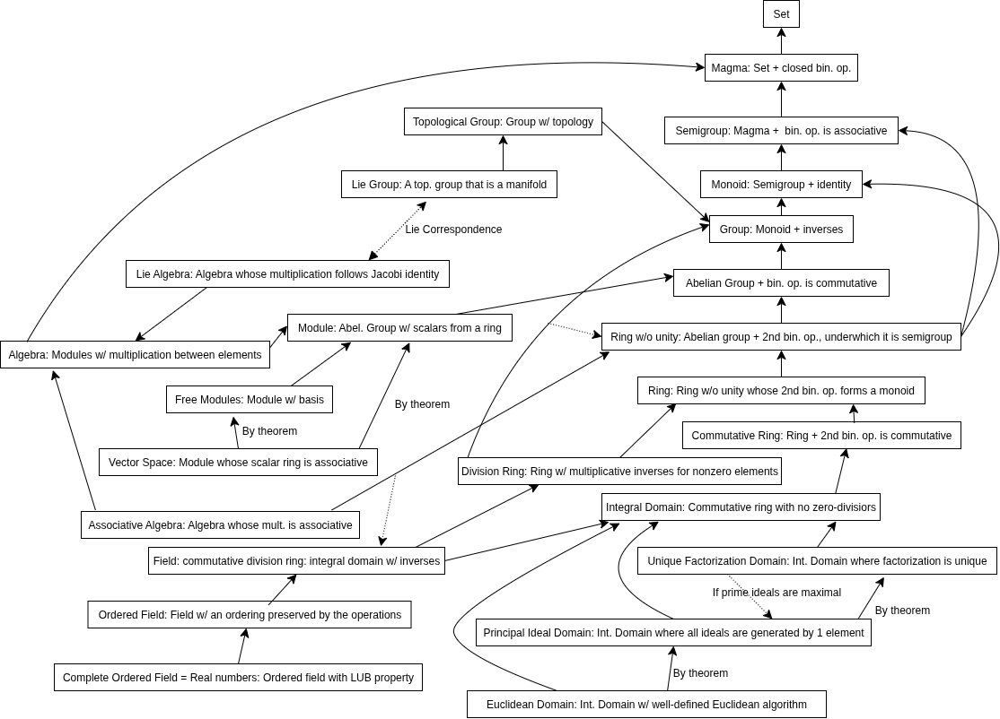

# Abstract Algebra Basics

An algebraic structure is a (non-empty) set equipped with a series of operations. Among algebraic structures, frequently used structures include groups, rings, monoids, semigroups, modules, etc.

An algebra is a vector space where vectors can be added and multiplied. As a simple example, since $n \times n$ matrices can be multiplied with each other, we can immediately think of $M_n(\mathbb{R})$ itself as an algebra.

A [Magma](https://en.wikipedia.org/wiki/Magma_(algebra)) is an algebraic structure with no additional conditions other than a set and a binary operation on it. That is, it refers to a set equipped with a function that assigns a unique element $m \cdot n \in M$ to any pair of elements $m, n \in M$.

A [Semigroup](https://en.wikipedia.org/wiki/Semigroup) is defined as $S$ when $S$ is a set and $\cdot : S \times S \rightarrow S$ is a binary operation satisfying the associative law. In other words, a semigroup is an associative magma.

A [Monoid](https://en.wikipedia.org/wiki/Monoid) is an algebraic structure that satisfies the axioms of associativity and identity element.

A [group](https://en.wikipedia.org/wiki/Group_(mathematics)) is a set with multiplication, inverse elements, and identity element defined.

A [Pseudoring](https://en.wikipedia.org/wiki/Rng_(algebra)) is a set with multiplication/addition binary operations, additive inverse/identity defined.

A ring is an algebraic structure with addition and multiplication defined. Specifically, a ring $(R, +, \cdot, 0, 1)$ is a set equipped with binary operations $+: R \times R \rightarrow R, \cdot: R \times R \rightarrow R$ and satisfying the following axioms:

- $(R, +)$ forms an abelian group. (additive associativity/commutativity/identity existence/inverse existence)
- $(R, \cdot)$ forms a monoid. (multiplicative associativity/identity existence)
- The distributive law holds between addition and multiplication. (right/left distributive laws)

A [field](https://en.wikipedia.org/wiki/Field_(mathematics)) is a division ring that is a commutative ring. That is, $(K, +, \cdot, 0, 1)$ satisfying the following conditions is called a field:

- For the additive identity $0$ and multiplicative identity $1$ of the field, $0 \neq 1$
- All elements except $0$ are invertible elements

The set of scalars is a field.

A vector space is an additive abelian group.

A [Module](https://en.wikipedia.org/wiki/Module_(mathematics)) is an abelian group very similar to a vector space, but where the scalars need not necessarily be a field. An $R$-module is a generalized vector space over a ring $R$. A vector space is a special case where $R = \mathbb{F}$.

An [Algebra over a field](https://en.wikipedia.org/wiki/Algebra_over_a_field) $\mathbb{F}$ is a structure with a vector space $A$ and a [bilinear](https://en.wikipedia.org/wiki/Bilinear_map) [product](https://en.wikipedia.org/wiki/Product_(mathematics)) $\mu: A \times A \rightarrow A$ that is associative and has a unit 1. Examples include $M_n(\mathbb{F})$, polynomial algebra $\mathbb{F}[x_1, \ldots, x_m]$, exterior algebra $\Lambda V$, and tensor algebra $T(V)$.

TBA

---

A [$\sigma$-algebra](https://en.wikipedia.org/wiki/%CE%A3-algebra) is a mathematical model of partial knowledge states about outcomes. Given a probability space $(\Omega,\Sigma,P)$, let the set $\Omega$ be the set of possible outcomes of a probability experiment. Let the elements of $\Omega$ be $\omega$ in the sample space. For example, when $\Sigma$ is a $\sigma$-algebra and $A\in\Omega$, regardless of whether $\omega\in A$ or not, $A\in\Sigma$. A Semiring is a collection of sets $F$ that satisfies the following conditions:

- $\Phi\in F$, where $\Phi$ is the empty set
- If $A,B\in F$, then $A\cap B\in F$
- If $A,B\in F$, then there exists a collection of sets $C_1,\dots,C_n\in F$ such that $A\backslash B = \bigcup_{i\geq1} C_i$ (where $A\backslash B$ represents all elements of $A$ not in $B$)

An Algebra is a collection of sets $F$ that satisfies the following conditions:

- $\Phi\in F$
- If $\omega_1\in F$, then $\omega_1^c\in F$ ($F$ is closed under complementation)
- If $\omega_1\in F$ and $\omega_2\in F$, then $\omega_1\cup\omega_2\in F$ ($F$ is closed under finite unions)

A $\sigma$-algebra is a collection of subsets $\omega$ of $\Omega$ when $F$ satisfies the following conditions:

- $\Phi\in F$
- If $\omega\in F$, then $\omega^c\in F$
- If $\omega_1,\dots\omega_n\in F$, then $\bigcup_{i\geq 1}\omega_i\in F$

Every $\sigma$-algebra is an algebra, but the converse does not hold. It is closed under finite and countable unions and intersections.

A Borel $\sigma$-algebra is the intersection of all $\sigma$-algebras of subsets of $\mathbb{R}$ that contain all open sets. The collection of such Borel $\sigma$-algebras is called a Borel set. It contains all $\sigma$-algebras that include the entire collection of open sets.

The [exterior algebra](https://en.wikipedia.org/wiki/Exterior_algebra) is an algebraic system that produces the wedge product (exterior product). While the result of the outer product is a vector (a value with one specific direction), the result of the wedge product (exterior product) is a bivector (a value with two specific directions) - an oriented plane.

TBA

  <a href="{{ 'Phys/Phys_content.html' | relative_url }}" class="prev-button">Previous</a>

