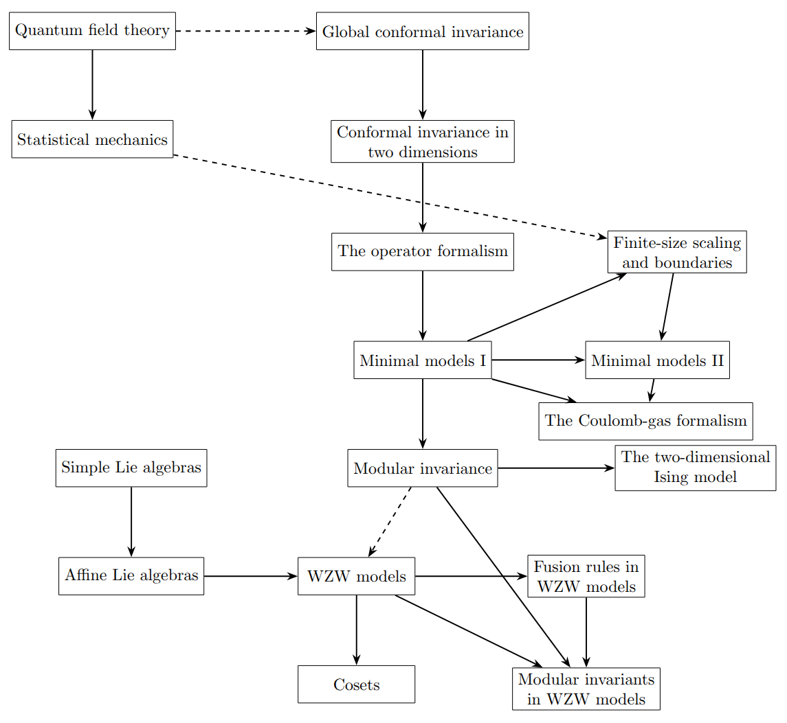

date: {{ page.date | date: "%Y.%m.%d" }}

# Conformal Field Theory

----

[Why Conformal Symmetry?](https://youtu.be/8toj7afHgU0?si=2wozABUrQxkWK-AU)

[Invitation to Conformal Field Theory](https://youtu.be/1SiN9ttjgOE?si=cNV5bcAUfKT5T5SZ)

[Conformal Field Theory for Particle Physicists](https://arxiv.org/abs/2207.09474)

[Applied Conformal Field Theory](https://arxiv.org/abs/hep-th/9108028)

[Available lecture notes of Bert Schellekens](https://www.nikhef.nl/~t58/lectures.html)

[Introduction to Conformal Field Theory](https://beckassets.blob.core.windows.net/product/readingsample/10075813/9783642242472_excerpt_001.pdf)

*Conformal Field Theory*, Francesco

  <a href="{{ '/Phys/Phys_content.html' | relative_url }}" class="prev-button">Previous</a>

