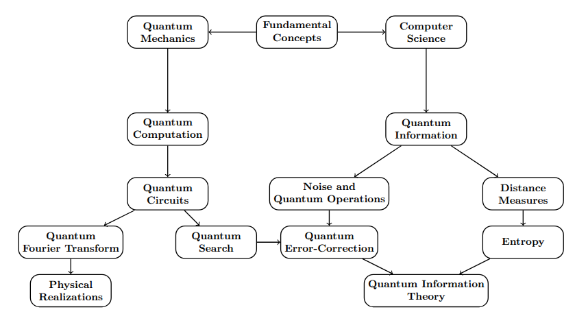
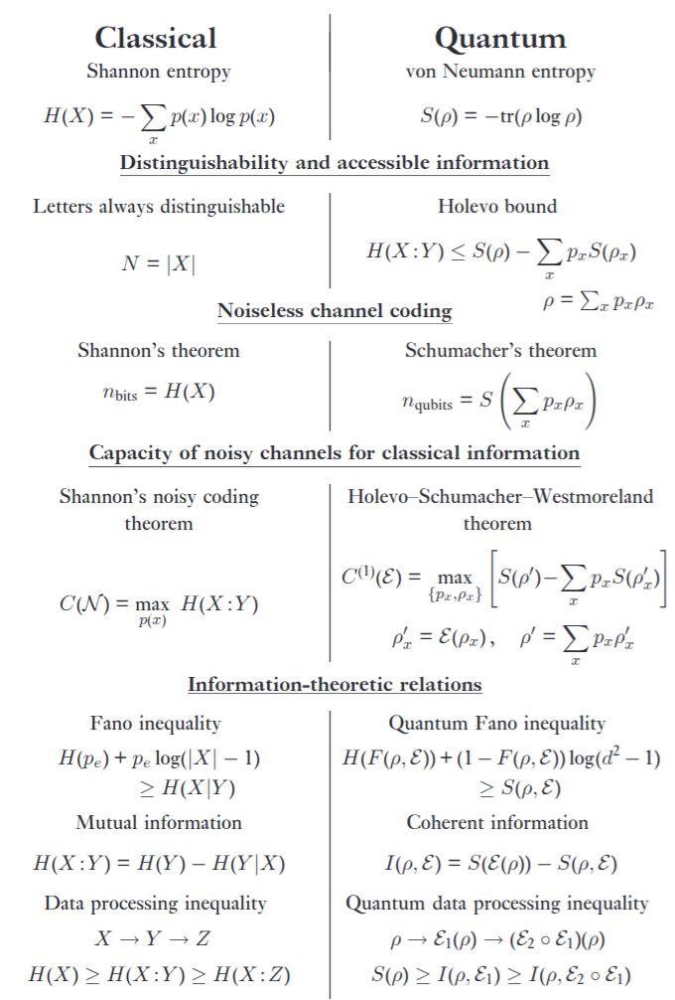

date: {{ page.date | date: "%Y.%m.%d" }}

# Quantum Computing and Quantum Information Cheat Sheet

## Classical vs Quantum, Canonical structure
- Canonical commutation relation  
  $$
  [x,p]=i\hbar
  $$
- Heisenberg uncertainty (uncertainty relation)  
  $$
  \Delta x\,\Delta p \ge \frac{\hbar}{2}
  $$
- Classical Hamiltonian  
  $$
  H_{\rm cl}(x,p)=\frac{p^{2}}{2m}+V(x)
  $$

## Dirac notation & Hilbert space
- State normalization  
  $$
  \langle \psi|\psi\rangle=1
  $$
- Resolution of identity (orthonormal basis)  
  $$
  \sum_i |i\rangle\langle i|=I
  $$
- Projector (outer product)  
  $$
  P_\psi=|\psi\rangle\langle\psi|,\qquad P_\psi^2=P_\psi
  $$
- Expectation value  
  $$
  \langle A\rangle_\psi=\langle\psi|A|\psi\rangle
  $$

## Postulates: dynamics & measurement
- Schrödinger equation (time evolution)  
  $$
  i\hbar\,\frac{d}{dt}|\psi(t)\rangle=H|\psi(t)\rangle
  $$
- Unitary evolution; density operator  
  $$
  U(t)=e^{-iHt/\hbar},\qquad \rho(t)=U\rho(0)U^\dagger
  $$
- Born rule (POVM measurement)  
  $$
  p(j)=\mathrm{Tr}(M_j\,\rho),\quad M_j\ge0,\quad \sum_j M_j=I
  $$
- Kraus update (post-measurement state)  
  $$
  \rho\ \to\ \frac{K_j\rho K_j^\dagger}{p(j)},\qquad M_j=K_j^\dagger K_j
  $$
- Two-outcome projective measurement  
  $$
  M_0=P,\quad M_1=I-P
  $$

## Qubit, Pauli, Bloch sphere, Single-qubit gates
- General pure qubit (Bloch angles)  
  $$
  |\psi\rangle=\cos\frac{\theta}{2}\,|0\rangle+e^{i\phi}\sin\frac{\theta}{2}\,|1\rangle
  $$
- Bloch representation (Pauli vector)  
  $$
  \rho=\tfrac12\big(I+\vec r\cdot\vec\sigma\big),\qquad |\vec r|\le 1
  $$
- Pauli matrices  
  $$
  \sigma_x=\begin{pmatrix}0&1\\1&0\end{pmatrix},\ 
  \sigma_y=\begin{pmatrix}0&-i\\ i&0\end{pmatrix},\ 
  \sigma_z=\begin{pmatrix}1&0\\0&-1\end{pmatrix}
  $$
- Single-qubit rotation (SU(2))  
  $$
  R_{\hat n}(\phi)=e^{-i\frac{\phi}{2}\,\hat n\cdot\vec\sigma}
  $$
- Pauli expectation ↔ Bloch vector  
  $$
  \langle \sigma_k\rangle=\mathrm{Tr}(\rho\,\sigma_k)=r_k
  $$
- Mixed state (convex mixture), purity  
  $$
  \rho=\sum_k p_k\,|\psi_k\rangle\langle\psi_k|,\quad \rho\ge0,\ \mathrm{Tr}\rho=1,\quad 
  \mathrm{Tr}(\rho^2)\le1
  $$

## No-go & state discrimination
- No-cloning theorem  
  $$
  \nexists\, U:\ U|\psi\rangle|0\rangle=|\psi\rangle|\psi\rangle\ \ \text{for all }|\psi\rangle
  $$
- Helstrom bound (minimum-error discrimination)  
  $$
  P_{\rm err}^{\min}=\tfrac12\Big(1-\|p_0\rho_0-p_1\rho_1\|_1\Big),\qquad 
  \|X\|_1=\mathrm{Tr}\sqrt{X^\dagger X}
  $$

## Universal gates / logic
- Universal gate set (example)  
  $$
  \{H,\ T=e^{i\pi\sigma_z/8},\ \mathrm{CNOT}\}\ \text{is universal}
  $$
- Classical universality (NAND)  
  Boolean NAND is universal for classical circuits.

## Physical models: Circuit / Adiabatic / MBQC
- Adiabatic interpolation  
  $$
  H(s)=(1-s)H_0+sH_1,\qquad s=\frac{t}{T}
  $$
- Adiabatic condition (gap condition)  
  $$
  T \gg \max_{s,m\ne n}\frac{\big|\langle m(s)|\partial_s H|n(s)\rangle\big|}{g(s)^2}
  $$
- Cluster state (MBQC resource)  
  $$
  |C\rangle=\prod_{(i,j)\in E}\mathrm{CZ}_{ij}\,|+\rangle^{\otimes N},\qquad 
  |+\rangle=\tfrac{|0\rangle+|1\rangle}{\sqrt2}
  $$

## Deutsch algorithm (circuit & adiabatic)
- Oracle (phase kickback form)  
  $$
  U_f|x,y\rangle=|x,\,y\oplus f(x)\rangle,\qquad f:\{0,1\}\to\{0,1\}
  $$
- One-query decision (constant vs balanced)  
  Prepare $H\otimes H$ on $|1\rangle|1\rangle$, apply $U_f$, measure first qubit.

- Adiabatic version (problem Hamiltonian)  
  $$
  H_1=\sum_x f(x)\,|x\rangle\langle x|
  $$

## Entanglement, witness, Bell
- Bell pair from circuit  
  $$
  \mathrm{CNOT}(H\otimes I)|00\rangle=\frac{|00\rangle+|11\rangle}{\sqrt2}=|\Phi^+\rangle
  $$
- Separable state (definition)  
  $$
  \rho_{AB}=\sum_k p_k\,\rho_k^{(A)}\otimes\rho_k^{(B)}
  $$
- Entanglement witness  
  $$
  \mathrm{Tr}(W\rho_{\rm sep})\ge0\ \ \forall\rho_{\rm sep},\qquad 
  \exists\rho_{\rm ent}:\ \mathrm{Tr}(W\rho_{\rm ent})<0
  $$
- CHSH operator & bounds  
  $$
  S=\langle A_0\!\otimes\!B_0\rangle+\langle A_0\!\otimes\!B_1\rangle+\langle A_1\!\otimes\!B_0\rangle-\langle A_1\!\otimes\!B_1\rangle,\\
  |S|\le2\ (\text{LHV}),
  $$
  $$
  |S|\le2\sqrt2\ (\text{quantum})
  $$

## Quantum channel (CPTP), Stinespring, Choi
- Kraus form (CPTP map)  
  $$
  \mathcal N(\rho)=\sum_k E_k\rho E_k^\dagger,\qquad \sum_k E_k^\dagger E_k=I
  $$
- Stinespring dilation  
  $$
  \mathcal N(\rho)=\mathrm{Tr}_E\!\big[U\,(\rho\!\otimes\!|0\rangle\langle0|)\,U^\dagger\big]
  $$
- Choi–Jamiołkowski isomorphism  
  $$
  J_{\mathcal N}=(\mathcal N\!\otimes\!\mathrm{Id})(|\Phi^+\rangle\langle\Phi^+|),\qquad 
  |\Phi^+\rangle=\frac{1}{\sqrt d}\sum_{i=0}^{d-1}|ii\rangle
  $$
- Complementary channel  
  $$
  \mathcal N^c(\rho)=\mathrm{Tr}_B\!\big[U(\rho\!\otimes\!|0\rangle\langle0|)U^\dagger\big]
  $$

## One-time pad & Teleportation (+ identities)
- Classical one-time pad (OTP)  
  $$
  c=m\oplus k,\qquad m=c\oplus k
  $$
- Teleportation (Bell-basis decomposition)  
  $$
  |\psi\rangle\otimes|\Phi^+\rangle=\frac12\sum_{\mu\in\{I,X,Y,Z\}}
  |\mathrm{Bell}_\mu\rangle\otimes \mu\,|\psi\rangle
  $$
- Transpose trick; trace identity  
  $$
  (A\otimes I)|\Phi^+\rangle=(I\otimes A^{\mathsf T})|\Phi^+\rangle,\\
  \langle\Phi^+|(A\otimes B)|\Phi^+\rangle=\frac{1}{d}\,\mathrm{Tr}(A B^{\mathsf T})
  $$
- Swap trick / Pauli twirl (qubit)  
  $$
  \mathrm{Tr}(AB)=\mathrm{Tr}\!\big[(A\otimes B^{\mathsf T})\,|\Phi^+\rangle\langle\Phi^+|\big],\qquad
  \frac{1}{4}\sum_{\sigma\in\{I,X,Y,Z\}}\sigma M \sigma = \frac{\mathrm{Tr}(M)}{2}\,I
  $$

## LU equivalence, Schmidt, Partial transpose
- Schmidt decomposition  
  $$
  |\psi\rangle=\sum_{i}\sqrt{\lambda_i}\,|i\rangle_A|i\rangle_B,\quad 
  \lambda_i\ge0,\ \sum_i\lambda_i=1
  $$
- Local-unitary (LU) equivalence  
  $$
  \rho'=(U_A\otimes U_B)\,\rho\,(U_A\otimes U_B)^\dagger
  $$
- Partial transpose (PPT criterion)  
  $$
  (|i\rangle\langle j|\otimes|k\rangle\langle \ell|)^{T_B}=|i\rangle\langle j|\otimes|\ell\rangle\langle k|,\\
  \rho^{T_B}\ge0\ \text{(necessary; and sufficient for }2{\times}2,\,2{\times}3)
  $$

## QKD (BB84/B92), security, parameter estimation
- BB84 states (mutually unbiased bases)  
  $$
  \{|0\rangle,|1\rangle\},\quad \{|+\rangle,|-\rangle\},\qquad 
  |{\pm}\rangle=\frac{|0\rangle\pm|1\rangle}{\sqrt2}
  $$
- Quantum bit error rate (QBER)  
  $$
  q=\Pr(a\ne b)
  $$
- Asymptotic key rate (Devetak–Winter)  
  $$
  K \ge I(A\!:\!B)-I(E\!:\!B)
  $$
  BB84 (symmetric, ideal devices)  
  $$
  K \ge 1-2\,h_2(q)
  $$
- B92 (two-state protocol)  
  Non-orthogonal states $\{|\psi_0\rangle,|\psi_1\rangle\}$ with $|\langle\psi_0|\psi_1\rangle|<1$ and unambiguous-discrimination-based sifting.

## Device-independent QKD (DI-QKD), CHSH randomness
- CHSH winning probability  
  $$
  p_{\rm win}=\tfrac12+\frac{S}{8},\qquad 
  p_{\rm win}^{\rm max}=\tfrac12+\tfrac{1}{2\sqrt2}
  $$
- Min-entropy bound (one typical bound)  
  $$
  H_{\min}(A|E)\ \ge\ 1-\log_2\!\Big(1+\sqrt{2-\tfrac{S^2}{4}}\Big)
  $$

## LOCC convertibility (Nielsen’s majorization)
- Majorization criterion  
  $$
  |\psi\rangle \xrightarrow{\rm LOCC} |\phi\rangle\ \ \text{iff}\ \ 
  \boldsymbol\lambda^\psi \succ \boldsymbol\lambda^\phi:
  \quad \sum_{i=1}^k \lambda_i^\psi \ge \sum_{i=1}^k \lambda_i^\phi\ \ \forall k
  $$

## Entanglement distillation
- Twirling to Werner/isotropic  
  $$
  \mathcal T(\rho)=\int dU\,(U\!\otimes\!U^*)\,\rho\,(U\!\otimes\!U^*)^\dagger
  $$
- Werner state  
  $$
  \rho_W=p\,|\Psi^-\rangle\langle\Psi^-|+(1-p)\,\frac{I}{4}
  $$
- Recurrence fidelity update (example)  
  $$
  F'=\frac{F^2+\frac19(1-F)^2}{F^2+\frac23F(1-F)+\frac59(1-F)^2}
  $$

## Entanglement measures
- Entropy of entanglement (pure state)  
  $$
  E(|\psi\rangle)=S(\rho_A)=-\mathrm{Tr}(\rho_A\log\rho_A)
  $$
- Concurrence (two-qubit)  
  $$
  C(\rho)=\max\!\big(0,\lambda_1-\lambda_2-\lambda_3-\lambda_4\big),\\
  \tilde\rho=(\sigma_y\!\otimes\!\sigma_y)\rho^*(\sigma_y\!\otimes\!\sigma_y),\ 
  \{\lambda_i\}=\text{eig}\!\left(\sqrt{\sqrt{\rho}\,\tilde\rho\,\sqrt{\rho}}\right)
  $$
- Entanglement of formation (two-qubit)  
  $$
  E_F(\rho)=h_2\!\Big(\frac{1+\sqrt{1-C(\rho)^2}}{2}\Big)
  $$
- Logarithmic negativity (PPT-based)  
  $$
  E_N(\rho)=\log_2\|\rho^{T_B}\|_1
  $$
- Relative entropy of entanglement  
  $$
  E_R(\rho)=\min_{\sigma\in\mathrm{SEP}} S(\rho\Vert\sigma)
  $$

## GHZ game / Mermin inequality
- GHZ correlations (GHZ state $|\mathrm{GHZ}\rangle=\frac{|000\rangle+|111\rangle}{\sqrt2}$)  
  $$
  \langle X\!\otimes\!X\!\otimes\!X\rangle=-1,\\
  \langle X\!\otimes\!Y\!\otimes\!Y\rangle=
  \langle Y\!\otimes\!X\!\otimes\!Y\rangle=
  \langle Y\!\otimes\!Y\!\otimes\!X\rangle=1
  $$
- Winning rule (promise $x\oplus y\oplus z=0$)  
  outputs $a,b,c$ must satisfy $a\oplus b\oplus c=(x\lor y\lor z)$.

## CHSH game
- Correlators (correlation function)  
  $$
  E_{xy}=\sum_{a,b\in\{\pm1\}} ab\,P(a,b|x,y)=\langle A_x\!\otimes\!B_y\rangle
  $$
- CHSH parameter & bounds  
  $$
  S=E_{00}+E_{01}+E_{10}-E_{11},\qquad 
  |S|\le2\ \text{(LHV)},\quad |S|\le2\sqrt2\ \text{(quantum)}
  $$
- Winning probability (uniform inputs)  
  $$
  p_{\rm win}=\tfrac12+\frac{S}{8}
  $$

## 2-qubit gates & circuit identities
- CNOT (controlled-NOT)  
  $$
  \mathrm{CNOT}=|0\rangle\langle0|\!\otimes\!I+|1\rangle\langle1|\!\otimes\!X
  $$
- CZ (controlled-Z)  
  $$
  \mathrm{CZ}=|0\rangle\langle0|\!\otimes\!I+|1\rangle\langle1|\!\otimes\!Z
  $$
- Hadamard conjugation (basis swap)  
  $$
  H X H=Z,\qquad H Z H=X,\qquad H Y H=-Y
  $$
- Control/target swap by local Hadamards  
  $$
  (H\!\otimes\!H)\,\mathrm{CNOT}\,(H\!\otimes\!H)=\mathrm{CNOT}_{\text{swapped}}
  $$

### Glossary
- Hilbert space: complete complex inner-product space  
- Projector / POVM: idempotent positive operator / set of positive operators summing to identity  
- Density operator: positive semidefinite trace-one operator  
- Unitary: $U^\dagger U=I$  
- Kraus operator: operator in an operator-sum (CPTP) representation  
- CPTP map: completely positive trace-preserving quantum channel  
- Schmidt coefficients: singular values in bipartite pure-state decomposition  
- PPT: positive partial transpose (Peres–Horodecki criterion)  
- LOCC: local operations and classical communication  
- Binary entropy: $h_2(p)=-p\log_2 p-(1-p)\log_2(1-p)$

---

## Information Theory: Classical vs Quantum

  <a href="{{ '/Phys/Q/Q_content.html' | relative_url }}" class="prev-button">Previous</a>

