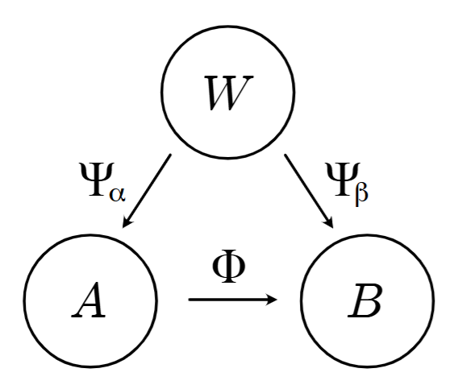
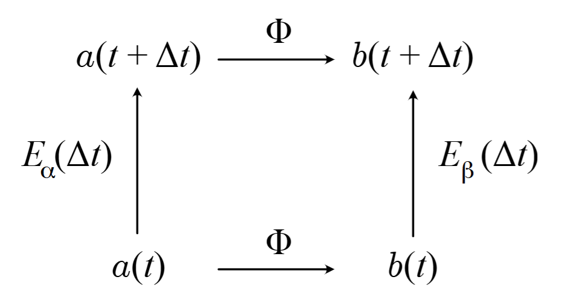

에세이 두 편의 한국어 번역본입니다.

# [What Emergence Can Possibly Mean](https://doi.org/10.48550/arXiv.2410.15468)

Sean M. Carroll, Achyuth Parola

## 초록

우리는 창발(emergence)을 동역학의 관점에서 고려한다. 즉, 시간에 따라 변화하는 시스템의 상태들을 바라본다. 특히 전체를 부분들로 분해하는 역할에 주목하여, 상위 수준 특성이 “새롭다”거나 “예상치 못하다”는 식의 표현을 사용하지 않고도 수준들 사이의 관계를 특성짓는 것을 시도한다. 우리는 창발의 다양한 종류들을 분류하여 제시하며, 이 때 상위 수준에서 새로운 존재론적 요소가 등장하는 경우와 그렇지 않은 경우를 모두 포함한다.

## 서론

모두가 창발의 중요성에 동의하지만, 그 용어의 의미에 대해서는 합의하지 않는다. 기본 개념은, 어떤 시스템을 많은 부분들의 합성으로 생각할 수 있을 때, 그 전체 시스템에는 각 부분의 특성과 거동만으로는 쉽게 예측할 수 없는 새로운 특성이나 거동이 나타날 수 있다는 것이다. 창발은 하나의 시스템에 대해 “미시적” (보다 근본적이고 포괄적이며 하위 수준의) 기술과 “거시적” (창발적인, 거칠게 묘사된, 상위 수준의) 기술이 모두 중요 특성을 포착할 때 관련된다.

창발은 어디에나 존재하며 우리가 현실을 다루는 방식에서 결정적인 역할을 한다. 우리는 세상의 미시적인 정보가 매우 불완전해도 세계의 다양한 특징들을 모델링하고 예측할 수 있다. 예를 들어, 테이블이나 의자, 더 나아가 사람에 대해 논의할 때, 그것들이 기본 입자들과 힘으로 이루어져 있다는 완전한 그림이 없어도 충분히 의미있는 대화를 할 수 있다. “온도”, “습윤(젖음)”, “흥분성”과 같은 성질들은 개별 입자에는 적용되지 않지만 거시 세계의 유용한 창발적 특성이다. 심지어 우연과 확률 같은 더 추상적인 개념들도 창발 현상으로 생각할 수 있다.

창발적 특성이 “새롭다”는 것을 엄밀히 규정하려고 할 때 모호함이 발생한다. 상황에 따라 다른 창발 개념들이 존재하며, 이는 매우 다른 존재론적 틀을 요구할 수도 있다. 전통적으로 “약한(weak) 창발”과 “강한(strong) 창발”을 구별하는데, 약한 창발에서는 상위 수준의 특성이 원칙적으로 하위 수준으로부터 따라나오지만, 강한 창발에서는 상위 수준 특성이 진정으로 새로운 것으로 여겨진다. 강한 창발 개념은 특히 의식을 이해하려는 몇몇 접근법에서 인기가 높으며, 생명의 기원 등 다른 논의에서도 언급된다. 또한 “인식론적(epistemic) 창발”과 “존재론적(ontological) 창발”의 구별도 있다. 전자는 주어진 시스템의 다른 수준에 대한 지식의 정도에 따라 그 특징을 기술하는 능력을 말하고, 후자는 창발적 특성이 하위 수준 특성으로 환원될 수 없는 방식으로 실제로 존재한다고 보는 입장이다.

이러한 구별은 유용할 수 있지만 여전히 부정확한 면이 있으며, 그 부정확함 때문에 해결되지 않은 개념적 문제들이 발생한다. 아마도 가장 두드러진 문제는 강한 혹은 존재론적 창발 개념과, 기본 물리학의 범위 및 성공 사이의 관계일 것이다. 어떤 영역에서 성공적인 하위 수준 이론이 있고 거시적 시스템이 하위 수준 부분들로 구성된다는 것을 인정한다면, 그 성공을 받아들이면서도 상위 수준 이론이 원칙적으로 하위 수준 이론으로부터 유도될 수 없을 것이라고 주장하는 것은 이상하게 보인다. 그것은 단순히 하위 수준 이론이 틀렸거나 적어도 불완전하며, 거시적 상황에도 적용되도록 적절히 수정되어야 한다고 말하는 것 아닌가? 예를 들어 인간의 뇌는 전자, 쿼크, 광자 및 기타 입자들과 장들로 이루어져 있는데, 이들은 양자장론(QFT)의 법칙에 의해 매우 정확하게 기술된다. 이러한 성분들의 어떤 특정 상태가 주어지면, 그 이론은 그 상태가 시간에 따라 어떻게 진화할지 명확히 예측한다. 의식이 강하게 창발한다고 믿는 것은, 예를 들어 전자의 거동에 대한 이 QFT의 예측이 인간 뇌 같은 상황에서는 잘못된 것이라고 요구하는 셈이다. 물론 그것이 불가능한 것은 아니지만, 이러한 상황에서 QFT의 일반 원리가 적용되지 않는다면, 실제로 옳은 이론은 어떤 모습일지 상상하기 어렵다. 이러한 어려움 때문에, 강한 창발론자들은 특히 기본 물리학과 관련해서 자신들이 의미하는 바를 매우 정밀하게 정의할 필요가 있다.

게다가 창발의 “새로움” 요소도 막연한 부분이 있다. 창발적 특성은 예상 밖의, 놀라운, 혹은 하위 수준 서술만으로는 도저히 유도 불가능한 것으로 종종 묘사된다. 그러나 무엇이 예상 밖이거나 새로운지는 개인의 판단에 달린 문제로 보이며, 엄밀한 지정이 아니다. 도저히 유도 불가능하다는 것조차도 정확히 구분하기 어렵다. 아직 유도되지 않았을 뿐일 수도 있기 때문이다. 창발을 기술하려는 형식적 시도조차도 여전히 모호한 개념들에 호소한다. 이처럼 창발 현상의 구분에 주관이 개입된다는 문제는 이전부터 제기되어 왔으나, 여전히 이 주제에 대한 철학 담론 전반에 만연해 있다.

## 개요

이 글의 목적은 개인적인 판단에 의존하지 않고 수준들 사이의 구체적 관계를 명시적으로 제시함으로써, 앞서 언급한 몇몇 문제를 명확히 하는 데 있다. 물론 창발의 다양한 버전을 분류하려는 시도는 이전에도 많았다. 우리의 접근 전략에는 세 가지 특징이 있다.

1. 동역학과 상태에 집중한다: 우리는 물리학에서 영감을 받은 접근법을 취하여, 특성이나 인과적 의존에 초점을 맞추기보다 상태와 상태의 동적 변화에 주목한다. 즉, 하나의 이론이나 모델은 어떤 명시된 상태공간과 (확률적일 수도 있는) 진화 규칙으로 구성된다고 보고, 이러한 관점에서 하위 수준 이론이 상위 수준 이론과 어떻게 관련될 수 있는지 탐구한다.
2. 부분-전체 관계(mereology)를 명시적으로 고려한다: 창발에 대한 논의에서는 거시적 시스템이 더 작은 부분들로 구성될 수 있다고 흔히 가정한다. 형식적으로 이는 시스템의 상태가 개별 구성 요소(입자, 격자점, 사람 등 무엇이든)의 상태들의 데카르트 곱으로 표현될 수 있다는 것을 뜻한다. 우리는 이러한 분해가 창발에서 어떤 역할을 하는지 명확히 하고자 한다.
3. “놀라움”과 “새로움”을 가능한 한 객관적 기준으로 대체한다: 우리는 가능한 범위 내에서, 창발적 이론이 “새롭다”거나 “예상하기 어렵다”거나 하는 평을 뒷받침하는 객관적 기준을 제시하고자 한다. 다시 말해 놀라움이나 참신함이라는 주관적 개념 대신, 이를 뒷받침하는 압축 가능성 등의 객관적 척도로 대체하려 한다.

우리는 이러한 접근법을 통해, 상태와 동역학의 수준에서 서로 다른 창발 개념들이 성립하기 위해 요구되는 조건을 밝힐 수 있기를 희망한다.

이상의 아이디어를 염두에 두고, 우리는 다음과 같이 창발의 다양한 종류를 분류하는 방안을 제안한다.

- **유형 0 (특징 없음) 창발:** 하위 이론이 부분계(subsystem)를 갖지 않는 경우의 다대일 사상으로, 시간에 따른 진화와 호환된다 (진화 연산과의 교환법칙을 만족한다).
- **유형 1 (국소적) 창발:** 두 이론 모두 상호 작용하는 부분계들의 모음을 기술하며, 거시 이론의 부분계들이 특정 미시 이론의 부분계들로 구성되는 경우의 다대일 사상으로, 시간에 따른 진화와 호환된다.
    - **유형 1a (직접적) 창발:** 알고리즘적으로 단순한 사상에 기반한 국소적 창발.
    - **유형 1b (비압축적) 창발:** 알고리즘적으로 복잡한 사상에 기반한 국소적 창발.
- **유형 2 (비국소적) 창발:** 미시 및 거시 이론 모두 국소적 부분계로의 분해를 가지지만, 거시 이론이 미시 이론으로부터 물려받은 국소성 개념을 따르지 않는 경우의 (유형 1과 유사한) 창발.
- **유형 3 (증강된) 창발:** 상위 수준에서 하위 수준에 아예 존재하지 않는 새로운 존재론적 특징들을 도입하는 관계에 기반한 창발.

우리는 이 중 어떤 한 종류만이 창발의 유일하게 올바른 정의라고 주장하려는 것이 아니다. 오히려 맥락에 따라 관련될 수 있는 다양한 개념들을 체계적으로 정리하는 데 도움이 되고자 한다. 우리의 유형 0, 1, 2는 모두 전통적으로 약한 창발의 다양한 버전에 해당한다. 왜냐하면 상위 수준의 동역학이 완전히 하위 수준의 동역학에 의해 결정되기 때문이다. 이들 서로 다른 유형은 상위 수준의 거동을 추론해내는 과정이 얼마나 직접적이고 단순한지 혹은 복잡하고 어려운지에 따라 구별된다. 유형 3은 상위 수준에서 새로운 존재론적 실체의 도입을 요구한다는 점에서 강한 창발에 가깝다. 이는 곧 하위 수준의 동역학만으로는 상위 수준의 거동을 예측하기에 불충분함을 의미한다. 우리의 분류가 유용한 점은, 이러한 상황을 설명하기 위해 필요한 이론적 구조가 어떤 것인지 명시적으로 보여줄 수 있다는 것이다.

이들 분류와 인식론적/존재론적 구별의 관계는 존재론(ontology)에 대한 관점에 따라 달라질 수 있다. 명백히, 증강된 (유형 3) 창발은 하나의 존재론적 창발 사례이다. 그러나 데닛(Dennett)이 주장했듯이, 유형 1과 유형 2 창발에서 묘사되는 상위 수준의 존재들을 “실재적(real)”으로 분류하는 것도 전적으로 타당할 수 있다. 이는 데닛의 “실재 패턴(real patterns)” 개념과 일맥상통한다. 창발적 기술의 존재는 미시 이론의 상태 정보 대부분을 버리고도 거시적 수준에서 상당히 정확한 예측을 할 수 있다는 것을 의미한다. 이렇게 적은 데이터만으로 그러한 예측을 할 수 있다는 것은 미시 이론에 대한 상당히 비자명한 사실이며, 그 결과로 얻어지는 거칠게 기술된 구조들은 “실재적”이라고 불릴 만하다. (우리가 다루지 않는 중요한 질문 하나는, 이러한 패턴이 언제 존재하는지 또는 그것을 어떻게 정량화할 수 있는가 하는 것이다)

## 설정

우리는 (아마도 아직 알려지지 않은) 현실 세계를 정확하고 완전히 기술하는 방법이 있다고 상정하고, 그 이론을 $\Omega$라고 표기하겠다. 이 이론은 어떤 상태공간(space of states) $W$을 가지며, 그 원소들을 $w \in W$ 등으로 표시한다. 만약 고전역학이 옳은 이론이었다면, 상태공간은 위상공간(phase space)의 구조를 가졌을 것이고, 그 안의 각 상태는 세계 구성 요소들의 위치와 운동량으로 이루어졌을 것이다. 실제로 고전역학은 옳은 이론이 아니며, 우리는 세계의 완전한 옳은 이론을 아직 모르므로, 구체적으로 명시하지는 않지만 어쨌든 어떤 상태공간이 있다고 가정할 것이다.

우리가 한 가지 중요하게 전제하는 것은 시간에 따른 진화(evolution through time)가 존재한다는 것이며, 관련된 진화 법칙은 마르코프적이라는 점이다. 즉 미래의 진화는 현재 상태에만 의존하며 (예를 들어 현재 상태에 암시적으로 포함되지 않은 이전 역사에는 의존하지 않는다)는 것이다. 이러한 마르코프 성질은 현재 널리 받아들여진 모든 기본 물리학 이론들의 특징이지만, 상위 창발 수준에서는 그리 분명하지 않을 수 있다. 이를테면 어떤 사람의 행동은 그 사람의 과거 일부를 알지 않고서는 이해하기 어려울지도 모른다. 그러나 그러한 과거의 영향이나 기억은 대개 현재 상태의 일부로 포함시켜 설명할 수 있다. 따라서 우리는 계속해서 마르코프 가정을 유지할 것이다. 이 가정하에서, 상태는 다음과 같은 어떤 진화 법칙에 따라 시간에 따라 변화한다.

\begin{equation}
\qquad w(t+\Delta t)= E_\Omega [w(t)] \tag{1}
\end{equation}

일반적으로 진화 법칙은 결정적일 필요는 없으며, 특정 상태 대신 확률 분포를 다뤄야 할 수도 있다. 그러나 이러한 구별은 우리 논의에서 핵심적이지 않으므로, 표기법을 간단히 하기 위해 모든 것이 결정적인 경우처럼 표기하기로 하겠다.

이제, 세계의 몇몇 측면을 기술하려고 하는 두 개의 이론을 가정해보자.

- **이론** $\alpha$ “미시 (micro)”: 상태공간 $A$, 개별 상태 $a$, 진화 법칙 $a(t+\Delta t)=E_\alpha[a(t)]$.
- **이론** $\beta$ “거시 (macro)”: 상태공간 $B$, 개별 상태 $b$, 진화 법칙 $b(t+\Delta t)=E_\beta[b(t)]$.

각 이론에 대해, 역시 진화가 마르코프적이라고 가정한다. 즉 시간 에서의 상태는 시간 의 상태에 의해 결정되며, 추가적인 과거 정보는 필요하지 않다.

**그림 1:** 세계($W$)의 상태공간과 미시적 이론($A$)의 상태공간, 거시적 이론($B$)의 상태공간 사이의 관계를 보여준다. 

엄밀한 표기법을 약간 벗어나서, 그림의 화살표들은 두 상태공간의 부분집합들 사이의 이항 관계를 나타낸다. 화살표로 나타낸 이유는 많은 경우 이러한 관계가 coarse-graining map의 형태를 취하기 때문이다. 즉, 하위 수준 그림의 다수 상태들이 상위 수준 그림의 하나의 상태로 사상된다(예: 많은 개별 원자들의 미시 상태들이 연속체 묘사에서 동일한 밀도 분포 등의 상태로 묘사되는 경우). 그러나 좀 더 정확히 말하면, 이 관계들은 함수(사상)가 아니라 이항 관계(binary relation)로 간주하는 편이 좋다. 함수의 정의에는 정의역의 각 원소가 치역의 유일한 원소와 대응된다는 조건이 있지만, 보다 일반적인 관계 개념에서는 일대일 대응이 아니어도 그저 한 집합의 원소들을 다른 집합의 원소들과 짝짓기만 하면 된다. 아래에서 살펴볼 유형 3 창발의 경우처럼, 상위 수준 $\beta$의 존재론이 하위 수준 $\alpha$에는 없는 특징들을 포함하는 예도 있을 수 있다. 이런 경우 단일한 하나의 미시 상태에 여러 개의 가능한 거시 상태들이 대응할 수 있다. 또한 이러한 관계들은 정의역이 제한적일 수도 있다. 즉 어떤 목표 이론의 적용 범위(domain of applicability)에서만 그 관계가 성립할 수 있다 (예: 유체역학은 충분히 많은 입자가 있을 때에만 운동론적 이론으로부터 창발한다).

우리는 이러한 관계들이 시간에 독립적이라고 가정한다. 그렇지 않다면, 언제든지 관계를 조정하여 시간 진화와 맞도록 만들 수 있기 때문에 창발이란 것이 자명해져 버릴 것이다. 또한 우리는 주로 창발 관계 $\Phi:A\rightarrow B$에 초점을 맞추겠지만, 그림에서 $\Psi_\alpha$와 $\Psi_\beta$라는 별도의 관계도 표시하였다. 이는, $W$의 어떤 상태들은 $\beta$로는 잘 기술되지만 $\alpha$로는 잘 기술되지 않을 수 있음을 강조하기 위함이다(즉, $W$에서 $\beta$의 도메인의 적용 가능성이, $\alpha$에서의 적용 도메인의 적용 가능성의 부분집합이 아닐 수도 있다).

## 유형 0 (featureless) 창발

첫 번째 경우로서, 미시 이론 $\alpha$의 상태공간 $A$는 별개의 부분계로의 선호되는 분해(decomposition)를 가진다고 가정하지 않는다. 창발 관계 $\Phi$는 coarse-graining map(정보를 거칠게 소거하는 함수)으로서, $A$의 미시 상태들의 집합들을 $B$의 단일 거시상태들로 보낸다. 이 관계가 창발을 기술한다는 판정 기준(criterion)은 단지 시간 진화와의 호환성(compatibility)이다. 이는 그림 2의 diagram commutativity로 표현된다. 시간 $t$의 어떤 미시 상태 $a\in A$로부터 시작해서, 우리는 두 가지 경로를 취할 수 있다. 하나는 창발 사상을 작용시켜 시간 $t$에서 어떤 상태 $b\in B$를 얻은 뒤에 거시 이론의 시간 진화 연산자 $E_\beta$를 따라 $\Delta t$ 앞으로 진화시키는 경로이고, 다른 하나는 먼저 미시 이론에서 $E_\alpha$연산을 사용하여 time-evolve 시키고 나서 창발 관계 $\Phi$를 적용하는 경로이다. 교환(commutativity)은 두 가지 경로를 따라 도달한 최종 거시 상태 $b(t+\Delta t)$가 동일하다는 것을 의미하며, 이 조건이 곧 “$\beta$가 $\alpha$로부터 창발한다”는 서술에 해당한다. 이를 공식적으로 나타내면 다음과 같다.

- **유형 0 (특징 없음) 창발:** (특정한 적용 가능 범위(domain of applicabability) 내에서) 미시 이론 $\alpha$의 상태들 $a\in A$에서 거시 이론 $\beta$의 상태들 $b \in B$로 가는 사상 $\Phi$가 존재하여, 이 $\Phi$가 해당 이론들의 시간-진화 연산자 $E_\alpha, E_\beta$와 교환한다. (즉, 를 적용한 뒤 에 의한 진화나, 에 의한 진화를 거친 뒤 를 적용한 결과가 같다.)

**그림 2:** 창발의 핵심에 있는, 시간 진화와 창발 사상의 관계를 보여주는 교환(diagram)의 도식을 나타낸다.

우리는 미시 이론의 모든 상태 $a\in A$에 대응하는 거시 상태 $b\in B$가 존재한다고 고집하지는 않는다. 창발하는 거시 이론이 정확히 들어맞는 제한된 적용 범위(domain of applicability) $A_E \subseteq A$가 있을 수 있다. 더 나아가, 그 정확성은 절대적이 아니라 근사적일 수도 있다. Coarse-grained dynamics은 일반적으로 어느 정도의 오차 범위나 일정 확률 내에서만 정확하기 마련이다.

유형 0 창발은 전통적인 창발 논의와는 다소 다르다. 전통 논의에서는 미시 이론을 부분계들로 분해할 수 있다는 것을 당연히 전제하고, 그 부분들이 모여 거시적 “전체”를 이룬다고 여긴다. 반면 유형 0 창발에서는 이러한 부분계 분해를 가정하지 않는다. 하지만 중요한 공통점은, 미시적 정보의 일부를 버려도(coarse-grained over, 소거해도) 유효한 거시적 동역학 법칙이 나타난다는 점이다. 이것이 바로 실재 패턴(real pattern)의 본질이다. 일반적으로 미시 상태에 관한 정보를 버리면 정확한 예측은 불가능해지므로, 이러한 종류의 창발이 성립하는 것은 매우 특별한 경우이다. 즉, 특정한 종류의 정보를 무시해도 거시적 예측 가능성이 유지되는 특수한 상황에서만 일어난다.

거시적 시스템이 미시적 동역학으로 기술되는 부분들로 이루어진다는 생각이 매우 널리 퍼져 있어서, 유형 0 창발의 흥미로운 예가 과연 있기나 한지 의문이 들 수도 있다. 그러나 잠깐만 생각해 보면 전형적인 사례 하나가 떠오른다. 바로 양자역학이다. 양자 상태는 힐베르트 공간 $\mathcal{H}$에 속하는 벡터 $\ket{\Psi}$로 표현되며, 이는 완비 노름(complete normed) 복소 벡터 공간이다. 서로 상호작용하지 않는 $n$개의 featureless 비상대론적 입자들의 집합이라면, 이 상태 벡터는 그 입자들의 위치를 변수로 가지는 정규화된 복소 값 함수 $\Psi(x_1, x_2, \dots, x_n)$로 나타낼 수 있다. 얽힘(entanglement) 현상은, 일반적으로 이 파동함수가 각 입자에 대한 함수들의 곱으로 분리될 수 없기 때문에 발생한다: $\Psi(x_1, x_2, \dots, x_n)\neq \Psi_1(x_1)\Psi_2(x_2)\cdots\Psi_n(x_n)$. 따라서 이 양자 시스템은 독립적인 동역학을 지닌 개별 부분들로 자연스럽게 분해되지 않는다. 일반적으로 전체 파동함수가 중요하다. (우리는 그래도 힐베르트 공간을 부분계들로 분해할 수는 있다. 다만 얽힘은 그것이 단순한 데카르트 곱이 아닌 텐서 곱 구조로 주어진다는 것을 의미한다. 이에 따라, 다양한 물리 상황에서 어떻게 이러한 분해를 최적으로 수행할지 묻는 것이 흥미로운 문제가 된다.)

그러나 특정한 특별한 상황에서는 유형 0 창발이 발생한다. 즉 고전적 극한(classical limit)의 경우이다. 만약 파동함수가 분리 가능하거나 거의 분리 가능하고, 각 개별 파동함수가 비교적 국소화되어 있으며 (질량이 큰 입자의 경우 이런 일이 발생함) 개별적인 파동함수들이 퍼텐셜 에너지 함수 $V(x_1, x_2, \dots, x_n)$가 변하는 길이보다 훨씬 좁은 영역에 localized 된다면, 에렌페스트 정리(Ehrenfest’s Theorem)에 따라 위치와 운동량,  $\braket{\hat{x_i}}=\bra{\Psi}\hat{x_i}\ket{\Psi}$와 $\braket{\hat{p_i}}=\bra{\Psi}\hat{p_i}\ket{\Psi}$의 기댓값이 근사적으로 고전적 운동 방정식을 만족하게 된다:

\begin{equation}
m_i\frac{d\braket{\hat{x_i}}}{dt}\approx \braket{\hat{p_i}}, \quad \frac{d\braket{\hat{p_i}}}{dt}\approx -\frac{\partial V}{\partial x_i} \tag{2}
\end{equation}

이는 명백히 coarse-graining map의 한 예이다. 즉, 연속적으로 무한히 많은 복소수를 통해 주어지는 파동함수 $\Psi(x)$가, 이산적인 위치와 운동량 값들의 집합으로 사상된다. 매우 많은 서로 다른 파동함수들이 동일한 고전적 위치와 운동량으로 사상될 것이다. 그러나 파동함수 자체에는 우리가 보통 생각하는 “부분”이 존재하지 않으므로, 이것은 유형 0 창발의 한 사례이다. 여기서 중요한 역할을 하는 것은 창발 사상의 제한된 적용 범위이다. 즉, 고전역학은 올바른 상황에서만 양자역학으로부터 창발한다. 그 상황이란 얽힘과 간섭이 동역학에서 중요하게 작용하지 않는 조건을 말한다.

다른 예로는 극한 과정을 통한 다른 종류의 거동을 들 수 있다. 예컨대 상대론적 역학의 뉴턴 역학적 극한(모든 상대 속도가 광속보다 매우 느린 경우)이 있다. 그 경우, 해당 적용 범위 내에서는 관련된 사상이 일대일이어서 (상대론적 위치와 운동량이 비상대론적 위치/운동량으로 대응되므로) 창발의 사례로서는 다소 사소한 경우일 것이다. 또 하나는 일반상대성 이론의 뉴턴 중력 극한으로, 이는 비상대론적 속도와 약한 중력장을 모두 필요로 한다. 이는 다대일 사상으로 생각해볼 수 있는데, 미시 이론(일반 상대론)에 대해 거시적으로 서로 동등한 다수의 상태들은 무시해도 될 만큼 작지만 0은 아닌 중력 복사(gravitational radiation) 양의 차이들에 의해 구별된다.

유형 0 창발은 시간 진화와 창발 사상 간의 교환을 특징으로 하는 도식을 기본으로 하며, 이후 논할 유형 1과 유형 2 창발의 토대가 된다. 창발의 결정적 특징은 유효한 거시 이론이 존재한다는 점인데, 여기서 “유효적(effective)”이라는 말은 거시 상태만을 사용하여ㅡ미시적 이론에 대한 언급 없이ㅡ그 거시 상태의 동역학을 (적어도 근사적으로) 기술할 수 있다는 것을 의미한다.

두 이론 간의 이러한 교환 관계(commuting relation)는 과학의 분과 간 구분을 잘 드러낼 뿐 아니라, 시스템 기술들의 관계를 설명하는 다른 개념들에서도 나타난다. 예를 들어 Bickle의 기능적, 설명적, 기계적 환원 구성 역시 다양한 coarse-graining 절차에 따른 여러 유형의 사상(mapping)으로 해석될 수 있으며, 이들 모두 유형 0의 제약을 만족한다. 어떤 시스템이 계산을 수행한다는 개념 또한, 분석적 기술과 실제 현상 사이의 교환(commutativity)에 의존한다. 따라서, 과학적 이론들 사이의 관계가 가장 분명한 예를 제공하지만, 우리가 제시한 유형 0 이후의 창발 분류는 매우 다양한 이론-대-이론 관계(theory-theory relations)에 대한 상위 분류로 널리 적용될 수 있다는 점을 주목할 필요가 있다.

전통적인 강한/약한 구분으로 보자면, 유형 0은 약한 창발의 부분집합이다. Bedau의 개념을 사용하여 설명하면, 미시 이론과 미시 상태, 그리고 창발 사상 $\Phi: A\rightarrow B$를 모두 알고 있다면, 미시 이론을 컴퓨터에 올려 거시적 거동을 추론할 수 있을 것이다. 그 거동이 놀라운지 아닌지는 다소 판단의 문제이고, 우리는 아직 그 구별을 엄밀히 짓지는 않을 것이다.

## 부분계 분해

유형 1 이상의 창발의 경우, 미시 및 거시 이론이 모두 상호 작용하는 부분계들의 모임을 기술한다고 가정하고, 창발 관계 하에서 그 부분계들이 서로 어떻게 연결되는지를 살펴본다.

먼저 부분계 구조(subsystem structure)를 가진다는 것이 무엇을 의미하는지 생각해야 한다. 많은 전통적인 예들에서 무엇이 부분계인지가 이미 주어져 있다. 즉, 어떤 구성 요소들의 집합을 출발점으로 삼고, 그것들을 모아서 더 큰 시스템을 형성한다. 그러나 이후 다룰 국소성(locality) 개념과 부분계 개념이 중요하기 때문에, 이 개념들이 요구하는 바와 함의를 구체적으로 짚고 넘어가는 것이 좋을 것이다.

우리는 시스템을 부분계들로 분해하는 것을 데카르트 곱으로 모델링할 것이다. 즉, 더 큰 시스템의 상태공간은 모든 부분계들의 상태들의 순서 있는 열(튜플)로 이루어진 공간으로 주어진다고 본다. 형식적으로, 하위 수준 이론 $\alpha$의 경우 다음과 같은 단사 사상(하나의 원소에 대해 유일하게 정의되는 사상)을 상정한다. 그것은 상태 공간 $A$로부터 부분계의 상태공간 $a_i$의 $I$개 공간 $A_i$ 간의 데카르트 곱으로 보내는 injective map이다.

\begin{equation}
D_\alpha: A\rightarrow \prod_{i=1}^I A_i \tag{3}
\end{equation}

이로써 개별적인 상태들은 $I$-튜플로 쓰일 수 있다.

\begin{equation}
D_\alpha:a\rightarrow (a_1,a_2,\dots,a_I) \tag{4}
\end{equation}

이 표기에서 $a_i$는 $i$번째 부분계의 특정 상태를 의미한다. 비슷한 구조가 상위 수준 이론 $\beta$에 대해서도 성립하여, $N\leq I$에서 부분계들로 분해된다.

\begin{equation}
D_\beta:B=\prod_{n=1}^N B_n, \quad b\rightarrow (b_1,b_2,\dots,b_N) \tag{5}
\end{equation}

데카르트 곱만이 큰 시스템을 부분계들로 분해하는 유일한 방법은 아니다. 중요한 예가 양자역학인데, 전체 시스템이 부분계들의 텐서 곱으로 기술된다. 그러나 앞서 논한 양자$\rightarrow$고전 창발이라는 유형 0 경우를 제외하면, 우리가 관심 갖는 시스템들은 일반적으로 데카르트 곱으로 분해된다.

하지만 일반적으로 (3) 형태의 분해는 상상할 수 있는 경우가 아주 많으므로, 그 중 옳은 분해를 선택할 방법이 필요하다. 우리의 막연한 생각으로는, 각 부분계가 일종의 정체성(identity)을 가져야 하고, 시스템 전체의 동역학이 부분계 각각의 개별 동역학과 부분계들 사이의 상호작용들로 서술될 수 있어야 한다. 이를 좀 더 명시적으로 하기 위해, 미시 이론에서 각 개별 부분계의 진화 법칙을 다음과 같이 쓴다고 상상해보자.

\begin{equation}
a_i(t+\Delta t)= E_{\alpha,i}^{(self)}[a_i(t)]+E_{\alpha,i}^{(int)}[a_i(t),\{a_{\bar{j}(t)}\}] \tag{6}
\end{equation}

이 식에 따르면, $a_i$의 진화에는 주어진 부분계 자체의 자기항(self term)과 다른 부분계들의 영향(상호작용 항)이 포함된다. 여기서 $\{a_{\bar{j}(t)}\}$은 $a_i$와 직접 상호 작용하는 부분계들의 집합을 나타낸다. 식의 오른쪽 첫째 항은 현재 해당 부분계의 상태 $a_i$에만 의존하고, 둘째 상호작용 항은 다른 미시 부분계들의 상태에도 의존한다.

식 (6)은 지극히 일반적인 표현이다. 이는 각 부분계의 진화가 그 부분계 자신의 상태와 나머지 모든 부분들의 상태에 의존한다는 아이디어를 반복한 것에 불과하다. 유용한 분해를 선택하려면, 각 부분계가 개별적인 정체성을 가진다는 생각을 구현해야 한다. 이는 다음 두 가지 요구 사항으로 요약된다. (1)다른 부분계들과의 상호작용을 “매우 멀리 떼어놓거나(moving them far away)” 혹은 어떤 결합 상수(coupling constant)를 0으로 설정함으로써 끄는(turn off) 상황을 가정할 수 있어야 하며, (2)그렇게 상호작용을 껐을 때 해당 부분계 상태 $a_i(t)$의 정보만으로 그 부분계의 동역학이 결정될 수 있어야 한다. 모든 부분계에 대해 이 요구 사항이 만족되면, 우리는 적절한 부분계 분해를 갖고 있다고 말한다. (실천적으로는 분해에 대해 일종의 극대성 조건까지 요구해야 할 수도 있다. 즉, 어떤 부분계도 둘의 더 작은 부분계로 나누어 생각하는 것이 더 적절하지 않아야 한다. 하지만 그 적절한 극대성의 개념은 다른 고려 사항에 일반적으로 의존하므로 (그렇지 않으면 모든 것은 기본 입자와 장으로 나뉘어 버릴 것이다), 여기서 그 아이디어를 더 자세히 논하지는 않겠다.)

이러한 요구 사항은, 원칙적으로는 상태공간을 데카르트 곱으로 분해할 수 있지만, 그 곱의 인자들이 우리가 부분계라고 부를 만한 것이 아닌 경우를 배제하는 역할을 한다. 예를 들어, $d$차원 공간에서 움직이는 $n$개 입자의 고전역학에서, 상태는 모든 입자의 위치와 운동량들로 이루어져 있다. 형식적으로, 우리는 모든 위치 변수들의 집합을 하나의 부분계로, 모든 운동량 변수들의 집합을 다른 하나의 부분계로 생각할 수도 있다. 그러나 그런 생각을 실제로 할 사람은 없을 것이다. 수학적으로는 위상공간(phase space)을 그렇게 인자화(factorization)할 수 있지만, 거기서 특별한 통찰이 얻어지지는 않는다. 더욱이 입자의 위치만 알고 운동량을 모른다면 (또는 그 반대의 경우도) 그 입자의 미래 진로에 대해 아무것도 말할 수 없다. 그러나 적절한 조건에서는 위치/운동량 쌍 $\{\vec{x}_i,\vec{p}_i\}$을 부분계를 묘사하는 것으로 취급하는 것이 의미가 있다. 즉, 개별 입자를 부분계로 삼는 것이다.

부분계들로의 분해는 상태공간을 하나의 네트워크로 생각할 수 있게 해준다. 부분계들은 그 네트워크의 노드(node)이고, 부분계 사이의 상호작용은 가중(edge)에 의해 표현된다. 실제로 부분계들 사이의 상호작용 강도는 다양하게 다를 수 있고, 어떤 것은 거의 상호작용하지 않을 수도 있다. 따라서 어떤 다른 부분계가 동역학에 가장 관련이 깊은지가 판단될 수 있다. 이러한 동역학적 관련도의 위계는 국소성(locality) 개념으로 생각할 수 있다. 뚜렷한 상호작용을 하는 부분계들은 “가깝다”고 볼 수 있고, 덜 관련된 것들은 “멀다”고 볼 수 있다. 물론 상위 수준 이론에서 이러한 표현은 꼭 물리적 거리와 대응하지 않을 수도 있다.

하위 수준 모델이 기본 물리학에 기반한 경우, 공간적 국소성(spatial locality)은 부분계의 자연스러운 개념을 암시한다. 예를 들어, 격자 위에 정의된 스핀들이 이웃 스핀들과만 직접 상호작용하는 Ising model을 생각해보자. 이때 특정 스핀은 멀리 떨어진 격자 위치에서 무슨 일이 일어나는지의 직접적인 영향을 받지 않는다. 오직 이웃한 스핀들의 매개를 통해서만 영향이 전달된다. 고전장 이론(classical field theory)도 비슷하게 작동한다. 시공의 한 지점에 있는 장(field)의 동역학은 그 동일한 지점(자기 자신 포함)의 여러 장들의 값과 그들의 시공 미분(derivative)에만 직접적으로 영향을 받는다. 이 미분들은 점과 점 사이의 무한소 변화를 담고 있으므로, 이들은 “이웃한 격자점”의 연속체 버전에 해당한다.

그러나 우리가 정의한 부분계 개념은 공간적 국소성보다 더 일반적이다. 예를 들어, 뉴턴 중력(힘이 거리의 제곱에 반비례)에 따라 공간을 이동하며 상호작용하는 입자들의 집합을 생각해보자. 이 경우 (inverse-square law인) 중력은 비국소적인 측면을 가진다. 라플라스(Pierre-Simon Laplace)가 보여주었듯이, 뉴턴 중력을 미분 방정식을 만족하는 퍼텐셜 장(potential field)으로 정의할 수도 있다. 그러나 그 장(field)은 독립적인 동역학 자유도가 아니라, 물질의 분포에 완전히 의해 결정된다 (일반상대론의 경우와 달리). 이런 의미에서, 그 이론은 국소적이지 않다. 격자 모형의 경우와는 달리, 이제 부분계들(입자들)이 강하게 상호작용하는지 그렇지 않은지는 상태(특히 입자들 사이의 거리)에 의존하게 된다. 그럼에도 불구하고 입자에 대해서는 합리적인 부분계 개념(개별성)이 성립한다. 모든 다른 입자들이 매우 멀리 떨어져 있는 경우 (즉 중력적으로 사실상 분리된 경우)를 생각하면, 고려하는 한 입자의 궤적은 오직 그 자신의 상태(그리고 필요하다면 어떤 배경 중력장)에만 의존하게 된다. 이는 입자의 위치와 운동량을 부분계로 생각하려는 잘못된 시도와는 대조적이다. 입자의 운동량을 모르고서는 그 다음 위치를 예측할 수 없기 때문이다.

마지막 예로, 인터넷을 통해 상호작용하는 사람들의 네트워크를 생각해보자. 어떤 개인은 일부 다른 개인들과는 직접적으로 상호 작용하지만, 다른 사람들과는 직접 상호작용하지 않는다. 그러나 그 상호작용의 강도는 물리적 거리와는 직접 연관되지 않을 수 있다. 말하자면, 적절한 부분계 분해란 동역학과 잘 들어맞아서, 올바른 조건 하에서 각 부분계가 어느 정도 독립성(autonomy)을 갖도록 해주는 것이다.

## 유형 1 (국소적) 창발

이상의 논의를 바탕으로, 다음과 같이 정의한다.

- **유형 1 (국소적) 창발:** 유형 0 창발(즉, 시간 진화와 호환되는 사상 $\Phi:A\rightarrow B$이 존재함)에 추가하여, 거시 이론의 부분계들이 미시 이론의 부분계들의 국소적 묶음으로 구성되는 경우.

여기서 “구성된다(consist of)”는 말은, 창발 이론의 각 특정 부분계 $B_n$의 상태 $b_n$이 미시 이론의 특정 부분계들의 모음의 상태 $\{a_i^{(j)}\}$에만 의존하며, 각 미시 이론의 부분계 $\{A_i^{(j)}\}$는 오직 하나의 거시 부분계 상태에만 기여한다는 것을 의미한다.

유형 1은 특히 물리학에서 흔히 논의되는 약한 창발의 많은 표준적 사례들을 포함한다. 앞서 언급한 아이징 모형이나, 유사하게 인접한 이웃과만 상호작용하는 격자 모형을 생각해보자. 카다노프(Kadanoff)가 재규격화 군(renormalization group)의 초기 논의에서 제안했듯이, 우리는 원래 격자를 여러$n \times n$ 구역으로 나누고, 각 구역에 대해 실제 스핀들의 평균값으로 정의되는 하나의 “블록 스핀(block spin)”을 대응시킬 수 있다. 이렇게 정의된 블록 스핀들과 그들 사이의 상호작용만을 사용하여, 장거리 극한(long-distance limit)에서 이 이론의 동역학을 논할 수 있다. 이는 창발의 직접적인 한 예이다. 더 일반적으로, Ultraviolet energy cutoff가 있는 유효 양자장 이론들은, 그 컷오프 이하에서 유효한 국소적 창발 이론으로 생각될 수 있다.

또 다른 예는 고전 뉴턴 역학의 질량중심 운동(center-of-mass motion)이다. 지구가 태양 주위를 도는 운동을 예측하기 위해 우리는 지구를 이루는 모든 입자의 상태를 알 필요가 없다. 지구와 태양계의 다른 천체들의 질량중심 좌표와 운동량만 알면 된다. 사실 질량중심의 예는 데닛이 “실재 패턴”의 전형적인 사례로 사용했던 것이다. 우리의 관점에서 이는, 미시 상태의 막대한 정보를 질량중심 데이터로만 요약하여 거칠게 소거하더라도, 천체들의 궤적에 대해 정확한 예측을 할 수 있다는 사실을 반영한다. 여기서 중요한 점은 올바른 방식으로 정보를 coarse-grain 해야 한다는 것이다. 미시 데이터의 임의의 부분을 버려서는 신뢰할 만한 예측을 전혀 할 수 없게 된다.

이징 모형이나 질량중심 운동의 경우, 거시 이론의 basic ontology는 미시 이론의 그것과 구조적으로 동일하다. 유형 1 창발의 정의 자체는 이러한 동일한 존재론적 구조를 요구하지는 않는다. 창발의 또 다른 흔한 예는, 다수의 상호작용하는 입자들의 미시 이론과 유체 기술(fluid description)이라는 거시 기술 사이의 관계이다. 이 경우 창발 사상은 공간의 작은 부피 요소를 취해, 그 부피 안에 있는 입자들의 상태에 대한 적절한 평균값을 계산하여 압력, 온도와 같은 거시적 물리량을 결정한다. 그리고 그 부피 요소를 충분히 작게 (하지만 여전히 다수의 입자를 포함하도록) 선택하는 극한에서, 이러한 물리량들은 연속체로 취급될 수 있다. 유체는 이산적인 입자 집합과 존재론적으로 다르지만, 그럼에도 불구하고 이것은 전형적인 유형 1 창발의 예이다.
여기서 미묘한 점 하나는, 특정 거시 부분계의 상태에 기여하는 미시 부분계들이 전체 미시 이론의 상태에 의존할 수도 있고(혹은 의존하지 않을 수도) 있다는 것이다. 예컨대 입자-유체(particles-and-fluids) 사례에서, 개별 입자(미시 관점에서의 부분계)들은 한 작은 평균화 부피에서 다른 부피로 이동한다. 이는 거시 부분계가 특정 미시 부분계들로 구성된다는 생각과 충돌하지 않으므로 문제가 없다. 비슷하게, 창발의 고전적 예로는 Conway의 Game of Life가 있는데, 이는 점멸자(blinker)와 글라이더(glider) 같은 집합적 구조가 나타나는 2차원 셀룰러 오토마톤이다. 글라이더는 이동하므로 그것이 점유하는 셀들의 집합이 변하고, 따라서 그것을 이루는 미시 시스템들(격자 사이트)도 변한다. 하지만 이것 역시 우리의 정의들과 양립한다. 또 Game of Life는 미시 규칙이 상대적으로 단순할 때에도 거시 이론이 복잡한 거동을 보일 수 있음을 보여주는 예이지만, 그러한 현상은 여기서 우리가 창발을 특성화하는 방식에서 중심적 역할을 하지는 않는다.
이와 같이 정의하면, 유형 0 또는 유형 1 창발은 전통적 의미의 약한(weak) 창발 대부분에 포함된다. 즉, 미시 이론의 상태와 진화 규칙을 가져다가 컴퓨터에 올려 돌리면, 거시 이론의 예측과 양립하는 거동을 얻을 수 있다. 그럼에도 불구하고 우리는 이 구분을 그을 가치가 있다고 생각한다. 우리가 유형 0이라 부른 것은 늘 창발로 인정되지는 않으며, 특히 더 나아간 창발의 다양한 형태를 고려할 때 국소적 분해(local decomposition)의 역할을 명시적으로 부각하는 것이 중요하기 때문이다.

## Novelty and compressibility

유형 1 창발은 곧장 이해되지만, 이 범주에 속하는 경우들 중에도 그 창발 이론과 그 성질이 “새롭다”, “놀랍다”, “예상 밖이다”, 심지어 “예측 불가능하다”라고 그럴듯하게 묘사될 수 있는 사례들이 있다. 그러나 이러한 표현들은 객관적 성질이라기보다 인간의 판단에 관한 것처럼 보인다. 누군가 놀라지 않거나, 애초에 그 창발적 거동을 기대했다고 주장하면 어떻게 될까? 국소적으로-창발하는 거시 이론의 어떤 거동도, 원칙적으로는 먼저 미시 이론의 동역학을 따라간 다음 창발 사상(emergence map)을 적용함으로써 예측 가능하지 않을까?

이러한 느낌의 일부는, 실제 창발 사상 자체의 성질ㅡ특히 그것이 단순한지 복잡한지ㅡ을 고려함으로써 보다 객관적인 방식으로 포착할 수 있다. 여기서 우리는 Kolmogorov, Chaitin 등으로 이어지는 의미의 알고리즘적 복잡도를 염두에 둔다. 즉 원하는 출력을 만들어내는 가장 짧은 컴퓨터 프로그램의 길이다. 원하는 출력을 만들어내는 간결한 공식(예: 10억 개의 0으로 이루어진 문자열)이 있을 때, 그 출력은 단순 혹은 압축 가능하다고 말한다. 반면, 가장 짧은 프로그램이 출력 자체의 명시적 표현을 포함하고 그것을 그대로 인쇄해야만 하는 경우(예: 특별한 성질이 없는 특정한 10억 자리 수), 그 출력은 복잡 혹은 압축 불가능하다고 말한다.

우리의 경우, 문제의 알고리즘은 창발 사상 $\Phi:A\rightarrow B$이다. (대개 다대일인) 이 사상은 간결한 방정식으로 표현될 수도 있고, 어떤 미시 상태들이 어떤 거시 상태들로 사상되는지를 명시적으로 열거해야 할 수도 있다(혹은 그 중간의 다양한 정도일 수도 있다). 예컨대 질량중심 운동이나 입자$\rightarrow$유체 창발의 경우에는, 미시 상태로부터 거시 상태를 구성하는 명시적 공식을 비교적 손쉽게 줄 수 있다. 질량 밀도는 단위 부피당 입자 수에 각자의 질량을 곱한 것이고, 압력은 입자들의 운동에너지와 관련되는 식이다. 반면 Game of Life에서 글라이더의 정의는, 해당 셀들의 개별 상태의 적절한 배열을 명시적으로 제시하는 것보다 크게 더 간결하게 만들 수 없다. 이로부터 다음과 같이 국소적 창발을 세분할 수 있다.

- **유형 1a (“직접적”) 창발:** 알고리즘적으로 압축 가능한 사상 에 기반한 유형 1 창발.
- **유형 1b (“비압축적”) 창발:** 알고리즘적으로 압축 불가능한 사상 에 기반한 유형 1 창발.

물론 이 구분은 스펙트럼 상의 연속적인 구분이며 완전히 양분되는 것은 아니다. 일부 사상은 극단적인 단순성과 완전한 비압축성의 중간에 해당할 수도 있다. 하지만 압축 가능성(compressibility)의 정도는 최소한 그 사상의 객관적 특징이며, 그것을 바라보는 우리의 태도 이상의 것을 반영한다. (일반적으로 알고리즘적 압축 가능성은 계산될 수 없지만, 근사적으로 평가될 수는 있다.)

여기서 직접적/비압축적 구분은, 창발에 대해 말하는 새로움이나 예상 밖임의 일부를 포착하고자 한 것이다. 창발 사상이 직접적인 경우, 그 결과로 나타나는 창발적 거동은 놀랍지 않다고 느껴지는 경향이 있다. 간단한 사상이 존재한다는 사실이, 우리가 집합적인 거동으로부터 예상해야 할 바에 대한 직관적인 감각과 부합하기 때문이다. 유체 역학의 존재론은 운동론적 이론(입자 기술)의 그것과 다를지라도, 유체가 분자들로 이루어졌다는 사실을 알게 되면 유체의 거동 자체는 우리에게 받아들이기 쉬운 것이 된다. 반면 명시적으로 하나하나 대응시켜야 하는, 압축 불가능한 창발 사상이 필요한 경우에는, 그에 수반된 창발적 거동이 놀랍거나 예상 밖인 것으로 느껴지기 쉽다. 대부분의 미시 부분계들이 어떤 특정한 거시적 방식으로 행동한다기보다는, 아주 특수한 경우에만 그런 거동이 나타난다는 것이다. 이러한 거동은 거시 관점에서 직관적으로 파악하기가 훨씬 어렵다.

## 유형 2 (비국소적) 창발

우리가 고려하는 다음 창발의 유형은 유형 0의 또 다른 세분이다. 이번에는 미시 수준에서의 국소성(locality)이 거시 수준에서는 드러나지 않는 경우를 다룬다.

- **유형 2 (비국소적) 창발:** 미시 및 거시 이론 모두 국소적 부분계들로의 분해를 가지고 있지만, 거시 이론이 미시 이론으로부터 유도된 국소성 개념을 그대로 따르지 않는 경우의 창발.

이러한 일이 일어나는 방식은 기본적으로 두 가지다. 첫째, 거시 이론은 어떤 자유도(degree of freedom)들을 포함할 수 있는데, 이들은 원칙적으로 미시 상태로 정의되지만, 미시적 관점에서 봤을 때 국소적인 부분들의 집합으로 구성되지 않는다. 즉, 거시적 존재들은 단순히 가까운 미시 부분계들이 결합하여 일관되게 행동하는 다발로 볼 수 없는 것이다. 둘째, 거시적 존재들이 서로 상호작용하는 방식이 미시적 관점에서 볼 때 비국소적으로 보일 수 있다. 어떤 경우든 거시 거동을 성공적으로 예측하려면 많은 (어쩌면 모든) 미시 부분계들의 상태를 알아야 한다. 다시 말해, 창발은 존재하지만, 서로 독립적인 부분계들 그룹들의 창발은 아니다. (우리가 유형 1 창발에서 도입했던 직접/비압축적 구분 역시 유형 2 맥락에서도 고려될 수 있지만, 여기에 별도의 하위 분류를 명시적으로 도입하지는 않을 것이다.)

이러한 비국소적 창발(Type-2)은, 거시 이론이 기본 입자와 장들로부터 크게 벗어나지 않은 경우에는 보통 일어나지 않는다. 그런 경우 미시 이론의 엄격한 국소성이 거시 이론에도 고스란히 이어져, 거시 수준에서도 진정한 비국소적 실체의 존재 가능성을 크게 제한하기 때문이다. 예컨대 강자성체(ferromagnet)의 경우, 스핀들 간 상호작용으로 인해 재료 전체에 걸쳐 동일한 자화 방향이 나타나는 비국소적으로 보이는 거동이 있을 수 있다. 이는 각 개별 해(solution)가 그 방정식들의 모든 대칭성을 만족하지 않는 자발적 대칭 깨짐(spontaneous symmetry breaking)의 한 예이다. 그러나 그 동역학은 거시 수준에서도 여전히 국소적이다.

하지만 생물학이나 사회과학과 같은 맥락에서는 비국소적 창발이 중요해질 수 있다. 기본적으로 정보 전달 속도의 한계인 광속은 여전히 존재하지만, 이는 본질적으로 관련된 시간 척도(timescale) 때문에 거의 무의미해진다. 실용적인 모든 측면에서, 거리에 상관없이 정보가 거시적 존재들의 동적 시간 척도보다 훨씬 빠르게 공유될 수 있다. 따라서 상호작용이 실질적으로 공간에 국한되지 않은 창발적 실체들이 존재해도 모순이 없다. 예를 들어 심리학이나 인지과학에서는, 인간을 다루는 상위 이론이 정신 상태(mental state)와 같은 것들을 포함할 수 있는데, 이는 특정 뉴런이나 세포 집단ㅡ더 말할 것도 없이 특정 원자나 입자 집단ㅡ과 연관지을 수 없다. (뉴런 전체 혹은 입자 전체의 적절한 상태와 연관시킬 수는 있지만, 국소화된 일부 집단과는 연관시킬 수 없다.) 이런 예로는 Searle의 생물학적 자연주의(biological naturalism)와 의식에 대한 통합 정보 이론(IIT) 등이 있다. 마찬가지로 사회나 집단의 역학을 상위 수준 이론으로 삼는 경우, 가장 간결한 창발 기술의 일부로 전역 변수(global variable)들을 포함하는 것이 자연스럽다. 예를 들어, 국제 관계의 인과 이론에서 조약 체결과 같은 요소는 중요한 역할을 할 수 있지만, 창발적 실체로서 그것은 특정한 미시적 존재들 집합과 동일시될 수 없다.

우리의 유형 2 창발 정의에 따르면, 거시 이론에는 비국소적 변수가 있을 수 있지만, 그것들은 결국 미시 이론의 상태에 의해 결정된다. 그런 의미에서 그것들은 진정으로 새로운 것은 아니다. 그럼에도 유형 2는, 비국소적 효과가 미시 동역학에 영향(Rückwirkung)을 미치는 가능성을 열어준다. 이런 영향은 순전히 미시적 관점만으로는 명백하지 않을 수 있다. 그 결과, 거시 이론이 미시 이론으로는 설명할 수 없는 거동을 보이는 것처럼 보일 수 있다. 그러나 궁극적으로는 “미시 이론이 단지 불완전했을 뿐”이라고 이해함으로써 설명될 수 있는 거동들이다 (즉, 미시 이론이 틀렸다기보다는).

다음과 같은 미시 부분계 에 대한 가능한 진화 법칙을 생각해보자.

\begin{equation}
a_i(t+\Delta t)= E_{\alpha,i}^{(self)}[a_i(t)]+E_{\alpha,i}^{(int)}[a_{i}(t),\{a_{\bar{j}}(t)\}]+\sigma_i[a(t)]E_{\alpha,i}^{(nl)}[a_i(t),\{a_{\bar{j}'}(t)\}] \tag{7}
\end{equation}

앞의 두 항(term)은 기존의 것이며, ((6)에서 익숙하게 본 바와 같이) $a_i$의 진화에는 해당 부분계에 대한 자기항과, 다른 부분계들의 영향을 나타내는 상호작용 항이 포함된다. 여기서 표기 $\{a_{\bar{j}(t)}\}$는 와 직접 상호작용하는 부분계들의 집합을 나타낸다. 자기항은 현재 부분계 상태 $a_i$에만 의존하며, 상호작용 항은 현재 다른 미시 부분계들의 상태에도 의존한다 (그리고 멀리 떨어진 부분계들의 영향은 더 작다).

세 번째 항이 유형 2 창발에서 허용되는 새로운 기여다. 이 항은 해당 부분계 자신과 (잠재적으로 다른) 다른 부분계들의 집합 $\{a_{\bar{j}'}\}$에 모두 의존하는 새로운 비국소 상호작용 인자 $E_{\alpha,i}^{(nl)}$를 포함한다. 이 새로운 항은 또한 시스템의 전역 미시 상태에 의존하는 필터 함수 $\sigma_i[a(t)]$로 곱해져 있다. 이 필터 함수는 완전히 미시적 영역에 속하는 상황에서는 0이 된다. 예컨대 적은 수의 입자들이 어떤 물리 실험에서 상호작용하는 경우에는 0이다. 그러나 그 필터 함수는 시스템 전체의 상태에 따라 (어쩌면 미묘한 방식으로) 결정되는 특별한 상황에서 0이 아닌 값을 갖는다.

다시 말해, 우리가 유형 2 창발이라고 부르는 경우에는, 실제로 전자가 인간의 뇌 속에서 우리가 아는 양자장론(QFT)이 예측하는 것과 다르게 거동할 수도 있다. 필터 함수는 원자들이 뇌처럼 배열되었을 때 켜지고, 그렇지 않으면 0인 식으로 작동할지도 모른다. 하지만 적은 수의 구성 요소들만 포함된 실험ㅡ입자 가속기의 고에너지 충돌 같은 경우ㅡ에서는, (7)의 첫 두 항만으로 기존의 양자장론에 의해 그들의 거동이 아주 높은 정확도로 제대로 기술될 수 있다. 차이점은 (적어도 어쩌면 있을 수 있는 차이점은) 동역학이 여러 가지 통상적인 실험 조건에서는 검출할 수 없을 정도로 미세하게 영향을 받는다는 것이다. 입자물리학 실험은 합리적으로도 대부분 가능한 한 작고 단순한 조건에서 수행되며, 이는 설령 미시 이론이 실제로 불완전하다고 해도, 그런 불완전성이 맨눈으로 드러나지 않게 만든다. (만약 거시적 복잡성이 일정 수준을 넘어가는 경우에만 그 불완전성이 표면화된다면, 작은 규모의 실험에서는 기존 미시 이론으로 아무 문제가 없을 수 있다.)

명확히 하자면, 양자장론에 관해 우리가 아는 모든 것은 이런 일이 일어나지 않음을 보장한다. 곧, 그러한 실험들에서 얻는 입자 상호작용에 대한 지식은, 많은 입자들이 뇌와 유사한 구성으로 모일 때에도 정확한 예측을 가능하게 해야 한다. 다만 어쩌면 이러한 상황들에서는 우리가 QFT에 관해 알고 있다고 생각하는 바가 틀렸을 가능성도 있다. 순수한 입자물리 관점에서 이를 의심할 원리적(principled) 이유는 없지만, 논리적 가능성으로서 배제되지는 않는다.

그러나 우리가 알고 있는 물리학과 완전히 양립하는 유형 2(Type-2) 창발의 경우들도 있다. DeDeo는 jerkㅡ가속도의 시간에 대한 도함수(즉, 위치의 3계 도함수)ㅡ의 예를 강조한다. 이는 관련 자유도들의 위치와 속도(또는 운동량)로 정의되는 고전역학의 근본 존재론의 일부가 아니다. 속도의 1계 도함수인 가속도는 시스템의 순간 상태만으로 계산할 수 있다$(\vec{a}=\vec{F}/m)$. 그러나 jerk는 그렇게 계산할 수 없고, 일정 시간 동안 시스템을 추적해야 한다. 그럼에도 우리는 일상에서, 예컨대 자동차나 엘리베이터의 운동에서 jerk를 경험한다. 이것은 하위 이론이 고전역학, 상위 이론이 인간 수준의 경험으로 주어지는 유형 2 창발의 한 사례다. 이를 이해하는 한 방법은, jerk가 고전적 상태의 국소적이고 순간적인 양들만으로는 계산될 수 없지만, 공간뿐 아니라 시간에 대해서도 coarse-grain(거친눈금화)한다면 계산될 수 있다고 보는 것이다. 그러나 그것이 엄밀히 필요한 것은 아니다. 고전물리의 규칙에 따르면, 전역적(global) 순간 상태에 담긴 정보만으로도 시스템의 모든 미래 진화를 결정하기에 충분하다. 우리의 설정에서, 거시적 인간이 경험하는 jerk는 (승객의 국소 상태뿐 아니라) 자동차의 상태, 운전자의 상태, 도로 조건 등으로 이루어진, 완전히 국소적이지 않은 어떤 미시 데이터 집합에 수반(supervene)된다. 상대론적 역학에서는, 관련 비국소 정보의 범위가 문제의 부분계의 과거 광원뿔(past light cone) 내부로 제한된다. 비상대론적 역학에서도 jerk를 결정하는 데 관련된, 너무 멀지 않은 영향들의 유효 집합이 존재한다.

창발에 관한 논의는 흔히 downward causationㅡ상위 수준 실체가 하위 수준 실체에 인과적 영향을 미치는 것ㅡ의 가능성을 다룬다. 엄밀히 말하면, 우리가 정의한 바에 따르면 그러한 현상은 유형 1이나 유형 2 창발과 양립하지 않는다. 두 경우 모두 미시 부분계의 동역학은 그 자체로 완전히 결정되기 때문이다. 그러나 유형 2 창발에서 (7)과 같은 새로운 거시적 상호작용의 가능성은 일종의 모조(counterfeit) downward causation으로 이어질 수 있다. 거시 관찰자에게는, 원칙적으로 미시 동역학이 전적으로 자족적(self-contained)임에도, 상위 수준 특징들이 미시 시스템의 거동에 직접 영향을 미치는 것처럼 보일 수 있다.

## 유형 3 (augmented) 창발

지금까지 우리가 고려한 모든 창발의 형태는, 대부분의 정의에 따르면 전통적으로 약한 창발로 분류될 것이다. 각 경우에, 상위 수준의 동역학은 하위 수준의 자유도(degree of freedom)에 포섭된다(supervene). 수준들 간 연결이 직접적일 수도 있고 미묘할 수도 있지만, 그럼에도 불구하고 확고히(ironclad) 연결되어 있다.

강한 창발은 이와 다르다고 여겨진다. 강한 창발에서는, 하위 수준의 작은 부분들이 미시적 동역학을 따를 때 집합적으로 일어나는 거동만으로는 (심지어 원칙적으로도) 설명할 수 없는 거시적 효과를 가정한다. 즉, 전체는 부분들의 합과 진정으로 다른 무언가라는 것이다.

강한 창발 개념은 주로 의식에 관한 접근법에서 진지하게 고려된다. 예를 들어 챌머스(Chalmers)의 어려운 문제(hard problem)에 대한 해답이나 창발적 범심론(emergent panpsychism) 이론들이 그런 경우이다. 우리의 용어로 말하면, 이들 이론은 의식이 관련된 거시 모델이, 세계의 미시 모델(앞서 언급한 이론들의 경우 전통적인 물리/생물학적 현실 모델과 의식적 존재들의 모델)과 강하게 창발한다고 주장한다. 이러한 의식에 관한 이론들에서는, 의식을 포함하는 모델과 물리적 또는 생물학적 미시 모델 사이에 어떤 형태의 유형 3 관계가 존재한다고 볼 수 있다. 미시 이론의 분해와는 무관하게, 독립적이고 관련 없는 새로운 종류의 객체 또는 실체가 의식에 필수적인 것으로 가정된다.

그러나 강한 창발 개념은 이해하기 어렵다. 상위 수준 시스템이 하위 수준 부분들의 모음이고, 우리가 그 부분들이 어떻게 거동하는지에 대한 미시 동역학 이론을 정확히 알고 있다면, 그 미시 이론은 그 부분들의 집합이 어떻게 행동할지에 대해 구체적인 예측을 내놓을 것이다. 그 예측은 정확하거나 부정확하거나 둘 중 하나일 것이다. 만약 부정확하다면, 미시 이론이 애초에 틀린 것이라고 말하는 것이 합리적일 것이다. 만약 정확하다면, 어떤 거시적 거동도 원칙적으로 미시 이론의 예측으로 환원 가능할 것이다. 미시 이론이 옳으면서도, 우리가 강하게 창발적이라고 부를 만한 새로운 거시 거동이 존재할 여지는 없어 보인다. 다시 말해, 미시 이론의 인과적 폐쇄(causal closure)는 강한 창발이 요구하는 새로운 거시 실체들과 양립할 수 없는 것이다.

여기서 우리는, 지금까지 고려한 틀 안에서, 이러한 겉보기에 모순된 상황을 피하면서 강한 창발의 일종을 받아들일 수 있는 방안을 제안한다. 기본 아이디어는, 거시 이론의 존재론(ontology)에 미시 부분계에는 포섭되지 않는 실체들이 있다고 상상해보는 것이다. 하지만 이 새로운 실체들의 동역학적 관련성(dynamical relevance)은 우리가 고려하는 미시적 구성 요소의 수가 작아지는 극한에서는 사라진다고 가정한다. 그렇다면 한 이론은 다른 이론으로부터 도출될 수 없지만, 두 이론 모두 적절한 영역(regime)의 상태와 동역학을 기술하기 위해 합리적인 과학자가 개발할 만한 것이라고 볼 수 있다. 이러한 경우의 창발을 우리는 “증강된(augmented) 창발”이라고 부른다. 상위 수준에 이러한 추가적인 거시 실체들이 출현하기 때문이다. 이러한 방식으로, 미시 이론을 사용하여 거시 문제에 대한 예측을 내놓을 수 있는데, 그 예측들이 (적어도 가끔은) 틀리게 된다. 비록 미시 이론이 순수하게 미시적 영역에 적용될 때는 완벽히 정확하다고 하더라도 말이다.

좀 더 구체적으로 말해보자. 우리는 지역적 부분계 $A=\prod_i A_i$로 상태들이 분해되는 미시 이론 $\alpha$를 가정한다. 이 미시 이론은 우리가 적은 수의 부분계들만 한 번에 진화하고 상호작용하는 상황만 고려하는 한 성공적으로 적용된다. 한편 거시 이론 $\beta$도 성공적이라고 하자. 하지만 (미시 이론의 관점에서 볼 때) 이 거시 이론의 적용 범위는 매우 많은 수의 부분계들이 서로 상호작용하는 상황을 포함한다 (적어도 특정 상태들에 대해서는). 이 두 이론의 적용 범위가 구별되어 있기 때문에, 거시 이론 $\beta$의 존재론 일부에는 미시 이론 $\alpha$에는 전혀 대응물이 없는 부분이 존재할 가능성이 있다. 즉, 거시 이론의 상태공간은, 미시 변수에 의해 고유하게 결정되는(supervenient) 변수들 $\{b_n\}$과, 그렇지 않은 새로운 독립 변수들 $\{\bar{b}_q\}$의 두 종류 변수에 의해 span 된다. 이 경우, $A$에서 $B$로 상태들을 연결하는 관계 $\Phi$는 더 이상 잘 정의된 함수일 필요가 없다. 왜냐하면 $A$의 단일 미시 상태들이 (그 새로운 변수 $\{\bar{b}_q\}$의 값에 따라 달라지는) $B$의 다중 원소들에 대응할 수 있기 때문이다. 대신, 이 관계를 이항 관계로 생각할 수 있다. 비국소 변수들의 값이 서로 다른 여러 거시 상태들과 미시 상태들을 서로 연결시킬 수 있는 것이다. 그러면 우리는 다음과 같이 정의할 수 있다.

- **유형 3 (증강된) 창발:** 미시 이론의 상태로부터 구성된 변수들과 미시 상태와 독립적인 새로운 변수들을 모두 포함하는 거시 이론이 존재하며, 이러한 새로운 변수들은 거시적 특정 상황에서만 동역학적으로 관련성을 갖는다.

이는 전통적으로 강한 창발이라고 생각되는 것과 부합한다. 거시 이론은 미시 이론으로 환원되지 않지만, 그렇다고 미시 이론이 틀린 것은 아니다. 단지 거시 이론이 쓰이는 영역에서는 미시 이론이 그대로 적용되지 않을 뿐이다.

증강된 창발(유형 3) 이론의 동역학은, 유형 2에서 살펴본 비국소적 효과와 유사하게 생각해볼 수 있다. 유형 3에서 우리는 (어떤 특정 전자와 같은) 미시 부분계의 진화 법칙을 다음과 같이 표현할 수 있다.

\begin{equation}
a_i(t+\Delta t)= E_{\alpha,i}^{(self)}[a_i(t)]+E_{\alpha,i}^{(int)}[a_{i}(t),\{a_{\bar{j}}(t)\}]+\sigma_i[a(t)]E_{\alpha,i}^{(aug)}[a_i(t),\{a_{\bar{j}'}(t)\}, \{\bar{b}_q(t)\}] \tag{8}
\end{equation}

유형 2의 경우처럼, 첫 두 항은 기존의 자기 항과 상호작용 항이다. 세 번째 항은 유형 3 창발에서 새롭게 추가되는 항으로서, 미시 부분계 $a_i$를 새로운 거시 변수들 $$\{\bar{b}_q\}$$ 및 일부 다른 미시 부분계들과 결합(couple)시키는 상호작용 인자 $$E_{\alpha,i}^{(aug)}$$를 포함한다. 

필터 함수 $\sigma_i[a(t)]$는 다시 한 번, 순전히 미시적 영역에 속하는 상황에서는 0이 되고, 적절한 상황에서 (전역 상태에 따라) 0이 아닌 값이 된다. 이러한 방식으로, 새로운 증강 변수들 $\{\bar{b}_q\}$은 오직 특정 상황에서만 동역학적으로 관련성을 띠며, 구성 요소가 몇 개 없는 실험에서는 보이지 않은 채(invisible) 남을 수 있다.

물리학의 현재 이해 관점에서 볼 때, (8)과 같은 것이 참일 거라고 의심할 근거는 전혀 없으며, 오히려 그렇지 않을 이유가 많다. 적어도 미시 변수들이 기본 입자와 장인 경우에는 더욱 그러하다. 이러한 맥락의 완전한 이론을 세우려 한다면, 그 결과 동역학이 제대로 정의되는지, 폭주하는 불안정성(ghost)이 없는지, 게이지 대칭과 보존 법칙들이 (적어도 실험적으로 허용되는 수준 이내로만) 유지되는지 등등을 모두 확립해야 할 것이다.

그러나 의식과, 어쩌면 생명의 기원과 진화 같은 문제들은 워낙 어려워서, 우리가 물리에 대해 알고 있다고 생각하는 바에서 벗어난 일들을 생각해보는 틀을 명시적으로 가지고 있는 것이 유용할 수 있다. 그리고 미시 이론의 부분계들이 그 자체로 복잡한 (예: 생물학적 세포부터 인간 행위자까지) 경우에는, 증강된 창발과 비슷한 것이 오히려 더 자연스러울지도 모른다.

## 결론

우리는 창발에 관한 이미 상당한 양의 문헌에 이 기여를 보태며, 철학적 논의와 상태 및 동역학에 대한 물리학적 관점 사이의 관계를 명확히 하는 데 도움이 되고자 한다. 우리는 창발의 기본 특징을, 특정한 종류의 실재 패턴(real pattern)이 존재하는 것으로 본다. 즉, 미시적 기술이 담고 있는 데이터보다 훨씬 적은 데이터를 기반으로 정확한 예측을 할 수 있는, 거칠게(grain-coarsed) 기술된 거시 이론이 존재한다는 것이다. 우리는 시스템을 특정 상호작용 유형을 지닌 부분계들로 분해하고, 미시 및 거시 수준에서의 분해 간 다양한 관계들을 면밀히 고려함으로써, 주관적 서술에 기대지 않고도 창발의 다양한 종류를 명시적으로 분류해낼 수 있었다.

----

# [Origin Gaps and the Eternal Sunshine of the Second-Order Pendulum](https://arxiv.org/pdf/1712.03113)

Simon DeDeo

### 초록

의도적이고 목표 지향적인 삶의 풍부한 경험은 물리학의 기본 법칙들로부터 예측할 수 없는 방식으로 출현한다. 여기서 필자는 이러한 예측 불가능성이 환상이 아니라고 주장한다. 곧 삶과 비-삶, 정신과 무심(無心), 그리고 기능적인 사회와 홉스적인 개체 집단 사이에는 실제로 간극이 존재한다는 것이다. 필자는 이러한 간극이 자기참조(self-reference)의 수학과, 자기참조적 시스템들이 제시하는 논리적 예측 장벽으로부터 발생한다고 제안한다. 그러나 한 가지 수학적 진리가 물리적 진실을 함의하지는 않는다. 우주는 자기참조를 가능하게 만들 필요가 없었다. 하지만 실제로 가능하게 만들었고, 그렇다면 질문은 어떻게 그렇게 했느냐이다. 이 에세이의 후반부에서 필자는 재규격화(renormalization)로 알려진 물리학의 기본적인 조치가, 망각적인 2계 미분 방정식(“forgetful” second-order equations)으로 이루어진 기본 물리로부터 우리가 소중히 여기는 주요 전환들을 가능케 하는 풍부하고 자기참조적인 세계로 어떻게 변모시키는지 보여준다. 우주가 어셈블리 코드로 작동하는 반면, 거친 눈금으로 본 버전은 LISP 언어로 작동하며, 목적과 의도를 지닌 세계는 그로부터 성장한다.

> 얼마나 행복한가, 그 무구한 수녀의 운명은!
> 
> 
> 세상을 잊고, 세상에 잊혀진 채.
> 
> 얼룩 없는 마음의 영원한 햇살!
> 
> 모든 기도는 받아들여지고, 모든 소망은 내려놓는다.
> 
> ㅡ Alexander Pope, “Eloisa to Abelard”
> 

우리가 눈으로 보는 세계와 우리가 물리 법칙으로부터 추론하는 세계들은 완전히 별개인 듯하다. 칠판 앞에서, 나는 얇은 가스 장막이 별과 은하 같은 객체들로 합쳐질 것임을 추론한다. 가설 몇 가지를 더하면, 초기 양자 요동에 대한 서술로부터 그 별들이 가져야 할 질량 범위를 예측해낸다. 오늘날에는 시공간의 잔물결이 안드로메다를 씨뿌린 기원이 되었다는 이야기조차 기본 물리의 제일원리들로 환원하는 것이 적절한 연구 목표로 여겨진다. 예컨대 지평선(horizon)에서의 호킹 복사나 다중우주의 양자 통계 등으로 말이다.

하지만 내가 칠판 자체의 존재, 그리고 그 위에 글을 쓰며 추론을 하는 사람들의 존재를 추론하려고 시도하면, 나는 막다른 길에 부딪힌다. 진화가 만들어낼 수 있는 욕망과 목표의 스펙트럼은커녕, 내 자신의 마음 깊은 곳에서 (겉보기에는 자발적으로) 떠오르는 욕망과 목표조차 나는 예측할 수 없다. 한 분야에서 잘 들어맞던 도구들이 새로운 영역으로 넘어가면 완전히 실패하는 경험을, 많은 과학자들이 겪는다. 과학자들만이 아니다. Sherry Turkle이 지적한 바와 같이, 심지어 어린 아이들도 전자 장난감을 접했을 때 그런 실패를 경험한다. 생명(혹은 생명의 하부층인 연산)의 경험에는, 다른 장난감에서 익숙한 순수한 물리 기작을 넘어서는 무언가가 있다. 겉보기에는 살아 있는 기계에 직면한 아이는 그것이 무엇으로 움직이는지 알아내려고 배터리 칸을 들여다본다. 칠판 앞의 성인 과학자가 느끼는 것이든 장난감 로봇을 든 아이가 느끼는 것이든, 본질적으로 그것은 인간 삶의 목적 있는 세계와 별들의 무목적 세계 사이의 간극을 경험하는 것이다. 우리의 도구들은 그 도약을 해내지 못한다.

물론 우리의 도구들은 의미를 만드는 존재들이 이미 존재한다고 가정할 수만 있다면 제대로 작동한다. 유체역학은 내가 사는 도시의 교통 흐름을 기술할 수 있고, 변형된 Ising 모형은 도시를 지나며 보게 되는 인종적 집합(segregation)을 예측할 수 있으며, 그밖의 일반화된 모형들은 너저분하게 배선된 내 뇌가 어떻게 학습하고 기억하며 경험을 할 수 있는지를 생각하는 올바른 출발점을 우리에게 제공한다.

그러나 의미를 만드는 존재들이 그 자체로 존재하게 될 것을 예측하라는 요구 앞에서는, 아무리 우리가 다른 조건하에서 잘 해왔더라도 비틀거리고 만다. 나는 이 간극ㅡ한쪽에서 다른 쪽으로 도약할 수 없는 무능력ㅡ이 설명을 요구하는 부분이라고 주장하며, 이러한 간극을 “기원 간극(Origin Gap)”이라고 부른다. 왜냐하면 그것은 사회의 기원, 의식과 의미의 기원, 생명의 기원 같은 “기원” 분야에서 일하는 이들에게 익숙한 것이기 때문이다. 이 간극은, 성숙한 대상들에 대한 과학들과 대비될 때, 해당 기원 분야들에 전혀 다른 색채를 부여하는 요소이다. 사회의 기원 연구는 사회과학이나 인류학과 매우 달라 보이고, 의식의 기원 연구는 심리학과 매우 달라 보이며, 생명의 기원 연구는 생물학과 매우 달라 보인다.

필자는 이 간극이 이해 가능하며, 심지어 (어떤 의미에서는) 예측 가능하다고 주장한다. 먼저, 이 에세이에서 나는 간극의 존재가 계산 이론의 기본적인 두 가지 사실 쌍으로부터 필연적으로 도출됨을 보여줄 것이다. 두 번째로, 물리법칙들의 특정한 측면들 때문에 우주의 진화 과정에서 이러한 간극이 자연스럽게 나타날 가능성이 매우 높음을 보일 것이다. 이 두 가지 사실을 합하면, “무심한” 법칙들이 어떻게 새로운 의도적 행동의 영역을 출현시키는지 설명할 수 있다. 이 에세이에서 간극을 설명하는 핵심은, 우리가 진정으로 중요하게 여기는 의도와 목표, 의미의 종류가 스스로를 참조할 수 있는 능력을 지니고 있다는 점이다.

## 1. The Mathematics of the Gap

수학적인 관점에서 볼 때, 기원 간극은 다음 두 사실에서 비롯된다.

1. **모든 것을 기술하는 것은 쉽다.**
2. **한 가지를 기술하는 것은 훨씬 더 어렵다.**

이는 직관에 반하는 느낌을 준다. 인간 개인으로나 인류 전체로나, 우리는 특정한 것들을 기술하면서 시작했다(저 큰 산, 이 언 강, 저 키 큰 여자, 이 추운 아침처럼). 따라서 이러한 작업이 일반화나 추상화의 더 정교한 습관들ㅡ집합론이나 범주론 등의 도구들ㅡ보다 쉬워야만 한다고 느낀다.

그러나 이러한 도약을 할 때, 우리는 그러한 묘사를 만들어내도록 가르치는 데 수백만 년의 진화가 투자되었다는 사실을 잊는다. 하나라는 것이 둘이 아닌 것은 무엇을 의미하는지, 유용한 경계나 지속적인 패턴을 식별한다는 것은 무엇인지, 어떤 논증이 타당하다는 것은 무엇인지를 두고 끊임없는 논쟁이 벌어진다. 우리는 철학의 역사에서 이를 볼 수 있지만, 보다 현대적인 예시는 인공지능(AI)의 역사에서 찾아볼 수 있다. AI 분야에서는, 묘사의 규칙을 결코 철저하게 명시할 수 없다는 느낌에 이름을 붙였다. 그들은 이를 “프레임 문제(frame problem)”라고 불렀고, 전 세계의 선진 사회들은 이를 해결하는 데 수백 수천억 달러를 쏟아부었다. 그러다 어떤 것을 기술하는 문제를 가장 빨리 푸는 방법은 애초에 규칙을 명시하지 않는 것임을 깨닫고 말았다.

아름다운 석양이나 타당한 논증을 컴퓨터 코드로 정의하는 대신, 연구자들은 이제 인간의 반응을 관찰하고 모방하는 학습 기계를 구축한다. 컴퓨터에 고양이가 무엇인지 설명하려 들지 말고, 인터넷에서 우리가 고양이를 기념하기 위해 찍어 올린 사진들로부터 컴퓨터가 고양이가 무엇인지 스스로 학습하게 하는 것이다. 이런 식으로 코드 작성자는 진화의 축적된 지혜에 의존할 수 있다. 물론 이는 당연하다. 컴퓨터란 본디 진화한 생물들이 자신의 필요를 충족하기 위해 만든 것이기 때문이다.

오늘날 우리의 삶을 지배하는 AI에 관해서만큼은, 우리는 일단 사물들을 규칙으로 기술하는 작업을 포기했다. 하지만 대조적으로 모든 것을 기술하는 것은 간단하다는 사실이 드러났다. 그저 시도해보는 아주 사소한 일이 떠오르기만 하면 되기 때문이다. 보르헤스(J. L. Borges)는 「바벨의 도서관」이라는 단편 소설에서 바로 그 시도를 했다. 그는 연결된 육각형 방들로 이루어진 거대한 도서관을 상상했는데, 벽에는 책장이 있고 책장에는 책들이 쌓여 있으며, 각각의 책에는 알파벳 문자들과 공백, 쉼표, 마침표가 다양한 순서로 담겨 있다.

모든 것 속에 얼마나 많은 것이 담겨 있는가! 물론, 보르헤스의 도서관에는 압도적으로 많은 무의미한 책들ㅡ키보드를 두드리는 고양이들이 쓴 책들ㅡ이 있다. 그러나 (다시 말해, 당연히) 동시에 셰익스피어의 완전한 전집도 있고, 그 전집의 모든 가능한 변형판도 있으며, 모든 오탈자를 포함한 판본들도 있다. (보르헤스가 더 썼다면) 셰익스피어가 실제로 프랜시스 베이컨이거나 엘리자베스 1세이거나 화성에서 온 외계인이었다면 썼을 희곡들도 있고, 그런 가설들의 모든 잘못된 추론들까지 상상 가능한 한계까지ㅡ그리고 그 너머까지ㅡ존재한다.

우리가 어떤 책의 텍스트에도 즉각적으로 접근할 수 있다고 상상해보자. “셰익스피어”라는 단어를 포함한 모든 책을 찾는 것은 간단하다. 로봇을 보내 책 하나하나를 검색해서 해당 문자열을 포함한 책을 가져오게 하면 된다. 물론 엉터리 책들도 찾아낼 것이다. “…casa,cWas,,,qwh g Shakespeare acqq CO…”처럼 문자들이 마구 뒤섞였는데 그중 가끔 이름 철자가 우연히 맞아떨어지는 책들도 회수해올 것이다.

여기 더 어려운 문제가 있다. 셰익스피어에 관한 책들 중에서 말이 되는 책들을 어떻게 찾아낼 것인가? 로봇에게 지시를 내려 그런 책들만 모아오게 할 수 있을까? 혹은, 보르헤스의 도서관 배치를 컴퓨터 화면에 와이어프레임 이미지로 띄워놓고, 서가 배열 규칙을 옆에 두고서, 꺼낼 서가들을 윤곽으로 표시하거나 마우스로 클릭해볼 수도 있을 것이다.

매우 기본적인 몇 가지 가정 하에서(아래에서 다루겠지만), 상상은 할 수 있으나 실제로 실행할 수 없는 더 복잡한 질의가 존재한다는 점이 이상하다. 주어진 원의 넓이와 같은 넓이를 갖는 정사각형을 자와 컴퍼스만으로 작도하는 문제처럼, 가능해야 할 것 같지만 실은 불가능한 경우이다. 당신의 마우스가 그려내는 형상은, 부분적으로는 상상 가능하지만ㅡ“이 책, 저 책은 제외” 식으로ㅡ그 전체는 불가능한 형상이다. 그 형상의 무한히 섬세한 구조는, 각 스케일에서 위의 스케일과 완전히 무관하기 때문에 정의할 수도 그릴 수도 없는 형상인 것이다.

컴퓨터 과학자들은 보통 이런 불가능한 형상들을 아주 다른 방식으로 소개한다. 자기 참조가 가능한 것들을 묘사한 뒤, 이러한 자기참조적 대상들에 관한 질문들이 제대로 제기되었음에도 불구하고 답이 존재하지 않음을 보여주는 방식이다. 예를 들어, 두 수학자가 할 법한 게임을 생각해보자. 숫자 이름 대기 게임이다. “12보다 큰 가장 작은 소수”라고 하면 그 숫자 13을 가리키는 식이다. “2의 50승”은 훨씬 더 큰 숫자를 지칭하는데, 대략 100조보다 약간 큰 값이다. 어떤 것을 이름 붙이는 데에는 좋은 방법과 나쁜 방법이 있다(예컨대 “1 더하기 1 더하기 1 더하기…”는 10,000보다 큰 숫자를 이름 붙이는 매우 나쁜 방식이다). 당신은 수학자들이 가능한 한 가장 효율적이고 가장 짧은 방식으로 숫자를 이름 붙이려고 경쟁한다고 상상할 수 있다.

이 게임이 잘못 굴러가는 고전적인 예시는 적절하게도 보르헤스식 바벨 도서관을 소개한 만큼이나 적절하게, 옥스퍼드의 사서 G. G. Berry가 제시한 역설이다. 그는 우리에게 다음 문장을 생각해보라고 한다.

> “천 단어보다 적게 이름 붙일 수 없는 가장 작은 수.”
> 

이 문장은 꼬인 논리를 지니고 있다. 그것이 이름 붙이는 무엇이든, 분명 천 단어보다 적게 이름 붙이고 있다. 그러나 그 문장이 지칭하려는 무엇은 실제로 훨씬 더 긴 문장이 요구되는 어떤 것이다. 이런 역설의 해결은 문장을 거부하는 것이 아니라, 어떤 수에 대해서도 가장 짧은 서술을 찾아내는 완벽한 수학자(또는 기계)라는 가능성 자체를 배제하는 것이다. Berry의 역설이 드러내는 문제는, 자기 자신을 참조할 수 있는 특정 종류의 시스템들과 연관된 문제이다. Berry의 역설적인 문장은 (암묵적으로) 그것이 수행하는 행위, 즉 짧은 서술을 찾는 행위 자체를 참조한다. Berry의 경우 자기참조가 내포하는 불가능성이, 보르헤스 도서관에서 셰익스피어 관련 책들을 찾는 문제로 쉽게 이어질 수 있다.

이러한 형상들의 존재(혹은 그 구성 규칙의 부재)는 처음에는 직관에 반대되는 것처럼 보인다. 인간 존재의 본성은 가능한 것을 요구하는 데 있기 때문이다. “부엌에 있는 설탕을 전부 가져와”, “공대에 있는 모든 학생들을 찾아내” 같은 요구 말이다. 우리는 답이 없는 질문을 하는 데 익숙하지 않다.

그러나 그런 일이 벌어지려면 필요한 것은, “셰익스피어에 대한 말이 되는 책”이 무엇인지에 대한 어떤 기술도 단순한 패턴 일치(예: “Shakespeare”라는 단어가 존재하는지 여부) 이상의 것을 요구한다는 사실뿐이다. 불가능한 질문은, 그것들이 패턴 처리, 패턴 조작, 패턴 연산에 관한 것이 될 때 등장한다. 특히 어떤 것이 자기 자신의 서술에 작용할 수 있도록 충분히 정교해질 때 그런 문제가 생긴다.

물론 이것은 정확히 우리가 실제로 하는 바이다. 우리가 셰익스피어에 관한 책을 읽을 때, 단순히 단어를 세고 목록과 대조하는 것 이상을 한다. 우리는 그 단어들에 대해 생각하고, 단어들이 이루는 조합을 고려하며, 한 구절이 다른 구절에 대해 갖는 의미가 무엇인지 따진다. 우리는 어떤 단락의 논지를 추론하고, 반론을 추측하며 따라간다. 그리고 우리 또는 기계에게 그런 능력을 부여하면, 그가(혹은 그것이) 앞으로 무엇을 할지에 대해 우리가 묻고 답할 수 있는 질문들에는 근본적인 한계가 생긴다. 심지어 우리가(또는 기계가) 수행할 행동의 윤곽을, 우리가 예상하는 것과 예상하지 않는 것을 미리 그려보는 것조차 불가능해진다. 가스가 응축되어 별이 되는 과정을 추론하는 것과는 대조적으로, 우리가 미리 셰익스피어에 관해 학자들이 쓸 책들의 공간(가능성 집합)을 도출해낼 수는 없다.

이것이 기원 문제들이 어려운 이유이다. 우리를 가장 매혹하는 것들의 기원은, 시스템들이 새로운 자기참조적 능력을 획득하는 지점과 겹쳐 있다. 그리고 이러한 순간들은 새로운 범주들과 새로운 현상들로 이어지는데, 우리는 그것들을 사전에 예측할 수 없다. 일단 예가 주어지면, 우리는 그것에 대해 질문을 던지고 과학을 수행할 수 있다. 보르헤스의 도서관에서 특정한 한 권을 꺼내 읽을 수 있는 것과 마찬가지다. 그러나 일어날 수 있는 모든 일들의 공간을 처음부터 놓고, 자기참조적 과정에 근거해 무엇을 볼 것으로 기대하는지 윤곽을 그려내는 것은 전혀 다른 문제이다.

필자는 생명의 문제에 있어 자기참조의 중요성을 강조한 첫 사람이 아니다. Sara Walker와 Paul Davies는 생명 기원 문제의 핵심에 자기참조적 특징들이 있음을 지적한 바 있다. Stuart Kauffman은 자기참조를 생물학적 진화와 사회 진화의 핵심에 놓았고, 어떤 대목에서는 괴델적인 주장들을 명시적으로 추측하기도 했다. 필자와 협력자들의 사회 행동에 관한 연구는, 새떼에서든 영장류에서든 보이는 사회적 피드백(가장 원초적인 형태의 자기참조)이 정치 질서의 주요 전환의 기원에 놓여있음을 시사한다.

이렇듯 물리학과 우리가 삶과 연관짓는 의미 있는 경험들 사이의 간극은 뜻밖에도 수학적인 성격을 띠고 있다. 의미 있는 경험의 출현은 새로운 형태의 자기참조의 출현과 관련되어 있지만, 자기참조적 시스템들의 기본 속성들에 대한 질문들은 (논리적 모순에 빠지지 않기 위해) 물리적인 과학 등지에서 기대하는 완전하고 일반적인 방식으로는 답할 수 없다.

새로운 자기참조적 현상ㅡ이를테면 스스로를 참조하고 수정하며 복제할 수 있는 유기 고분자ㅡ의 결과를 개략적으로 그려보라는 질문을 받으면, 우리는 비틀거리고 만다. 왜냐하면 그 질문 자체가 답할 수 없는 것이기 때문이다. 특정한 사례(예: 박테리아 *E. coli*의 복제 기구)가 주어지면 우리는 많은 과학을 해낼 수 있다. 그러나 그로 인해 가능해지는 모든 생명을 윤곽 짓는 것은 보르헤스의 도서관에서 책을 고르는 것과 동등하다.

다음 장, 자기참조의 물리학으로 넘어가기 전에, 여기서 우리가 암묵적으로 행하고 있는 도약을 짚고 넘어갈 가치가 있다. 지구와 그 위의 모든 것은 유한한 본성을 지닌다. 일어날 수 있는 일은 한정되어 있다. 만약 홀로그래피 원리가 참이라면, 우리는 심지어 우리 행성의 세계선 경계 내에 담긴 총 엔트로피도 계산할 수 있을지 모른다. 이는 순수주의자들로 하여금 내가 여기서 제시한 주장에 반대하게 만들 수도 있다. 왜냐하면 괴델의 불가능성 정리들은 보통 어디선가 무한을 필요로 하기 때문이다. 명시적으로 말하면, 자기참조로 인해 불가능해지는 것들은 해당 영역의 모든 것들에 적용되어야 하는 것들이다. 예를 들어 모든 정수에 적용되는 명제, 모든 프로그램이 모든 입력에서 어떻게 작동하는지 등의 경우이다. 우리가 다루는 숫자들(유한한 크기의 책으로 구성된 보르헤스의 도서관의 크기, 혹은 인간 마음의 행동 구분 가능한 가능한 구성의 수)은 실제로 무한이 아니라, 그저 아주, 아주, 아주 큰 수들일 뿐이다. 이는 당신이 당신의 조수에게 무엇을 하라고 말하는 것이 가능함을 의미한다. 예를 들어, 당신이 직접 나가서 일정 길이보다 짧은 모든 책들을 다 읽은 다음, 그에게 목록을 줄 수도 있다. 이런 목록 기반 해법들은 짜증스럽긴 하지만, 그것들을 배제하기는 매우 어렵다. 명백히 불만족스럽지만, 왜냐하면 그것들은 답이 이미 손에 쥐어져 있다는 점에서 영어 문법을 가르친다며 만 단어 이하의 모든 문장을 그저 나열해주는 것과도 같기 때문이다. 우리가 원하는 것은 목록이 아니라, 뭔가를 요약하고 압축하여 규칙 기반의 통찰을 주는 것이다.

하지만 무한이 사라지면, 역설에 빠지지 않고 우리가 원하는 것에 근접하는 것이 가능해지는 경우도 있다. 예를 들어 우리는 Berry의 역설 때문에 “뒤틀린(self-referential) 자기참조”에 걸리기 쉬운 상황에서도 흔히 “가장 짧은 서술”에 대해 이야기하고 싶어 한다. 2014년 Scott Aaronson, Sean Carroll, Lauren Ouellette는 파일 압축 프로그램 gzip을 이용해서 이러한 상황을 비껴갔다! 이는 기발한 발상이고 (내 생각에) 그들이 풀고자 한 문제를 탐구하는 훌륭한 방법이지만, 모든 경우에 통용되지는 않는다. 예컨대 학생이 쓴 글의 복잡도를 판단하려고 그 글을 gzip으로 압축한 파일 크기를 보는 식의 일은 하지 말아야 한다. 우리는 일부 상황에서 휴리스틱이나 좋은 아이디어를 갖고 있지만, 불가능한 문제가 어떻게 점진적으로 해결 가능한 것으로 “격하”되는지를 일반적으로 잘 다루는 법은 아직 없다. 계산 복잡도 이론이 여기서 역할을 할 가능성이 높다.

노엄 촘스키는 그의 저서 *Aspects of the Theory of Syntax*에서 이 문제를 정면으로 다뤘다. 그는 언어 수행(우리가 실제로 말하는 것)과 언어 능력(우리가 말하는 것의 규칙을 파악하는 능력)을 구분하고, 좋은 규칙ㅡ우리가 원하는 종류의 규칙ㅡ이 “생성적(generative)”이어야 한다는 아이디어를 언어학에 도입했다. 촘스키의 언어 능력-수행 구분과, 끝없는 기술적 범주를 나열하기보다는 일반화 가능한 규칙 창출에 대한 강조 역시 이야기의 일부라 할 수 있다.

## 2. The Physics of the Gap

간극을 새로운 자기참조 시스템의 출현에 귀속시키는 것과, 왜 자기참조가 애초에 생겨나야만 했는지는 별개의 문제이다. 자기참조의 핵심에는 기억 장치(memory device)의 존재와, 그 안에서 “충분히 정교하게” 항해할 수 있는 무언가가 있다. Smith와 Szathmáry의 1997년 유명한 논문은 생물학적 기록에서의 주요 전환들을 다루는데, 이 점을 암묵적으로 인식하고 있다. 그들은 새로운 정보 처리 및 기록 메커니즘의 발견을 각 전환의 중심에 놓았다. 사회과학자들, “심층 역사” 연구자들, 인지과학자들 역시 도시 같은 새로운 제도나, 문자나 사회적 위계 같은 새로운 문화적 관습, 심지어 언어 구사와 구문 처리 같은 생리학적 새로운 능력 등, 우리가 기억하고 기억한 것을 변형하는 방식을 향상시키는 요소들을 주목한다. 중요한 도약은, 이전에는 잊혀졌을 (잡음 속으로 사라졌을) 것들이 기록되는 수단을 발견하고, 참조 가능한 형태로 변환되며, 처리되고 다른 것들과 결합될 때 발생한다. 사회적 빚이 모닥불가에서 들려주는 이야기로 바뀌거나ㅡ돈과 시장으로 변형될 때ㅡ우리는 기존 삶의 증대에 그치지 않고 완전히 새로운 형태의 존재가 예측 불가능하게 창조되는 것을 목격한다.

이 각각의 순간들은 세계의 본질이 변화하는 시점이고, 명백한 과학적 연구 주제들이다. 그 출현의 세부 사항을 연구하든, 혹은 역사적 맥락을 넘어 일반화되는 패턴들을 연구하든, 그 중 어느 하나도 한 평생의 과업이다. 그렇지만, 기억과 자기참조가 애초에 가능하게 된 이유는 무엇인가?

놀랍게도, 그것은 물리학의 근본 법칙에 내재한 것이 아니다. 필자는 경력 초기에 시카고 대학에서 이 사실을 뼈저리게 깨달았다. 당시는 애리조나 대학의 물리학자 Dimitrios Psaltis, Alan Cooney와 함께 근본 물리의 이상한 부류의 모형에 대해 궁리하던 때였다. 그 모형들은 수학적으로 일관성이 있었음에도 본질적으로 불안정했다. 그 법칙을 따르는 어떤 우주도 결국 시간과 공간을 막론하고 곳곳에서 폭발하여, 끝이 보이지 않는 에너지 분출을 일으키는 것이었다. 마치 바닥 없는 언덕 꼭대기에서 굴러 떨어지는 것처럼 말이다.

그 모형들이 불안정한 이유는 시간을 다루는 방식 때문이었다. 우리가 고등학교에서 접하는 물리학에서는, 뉴턴 운동법칙이 힘과 가속도 사이 관계를 다룬다는 것이 매우 중요하다. 즉, 힘은 질량과 가속도의 곱이라는 것, 또는 더 쉽게 말하면 가속도는 힘을 질량으로 나눈 것이라는 것이다($F = ma$, 혹은 동치로 $a = F/m$). 가속도(acceleration)는 시간의 경과와 연결된다. 물체의 속도가 얼마나 빨리 변하는지, 보다 형식적으로 말하면 “시간에 대한 위치의 2계 도함수”가 가속도이다. 그런 다음 뉴턴의 법칙은 물체가 경험할 힘을 중력이라는 현상과 연결시킨다. 물체들은 중력장을 만들고, 각 지점에서 그 장은 물체에게 일정한 크기의 힘을 가한다. 또 다른 법칙들은 전기나 자기 같은 다른 힘의 원천에 대해 이야기한다. 모든 법칙이 다시 가속도로 연결된다. 즉 시간이 지남에 따라 속도가 어떻게 변하는가로 귀결된다.

이 모든 것은 굉장히 멋지고 (특정한 취향의 사람에겐) 매우 매력적인 이야기지만, 이 법칙들의 기본적인 특징 중 하나는 기본 방정식에 2계 도함수를 초과하는 항이 절대 등장하지 않는다는 것이다. 법칙을 적어보면, 언제나 (1) 기본적인 몇 가지 양들(예: 위치, 중력장 등), (2) 이 양들이 시간에 따라 어떻게 변하는지, (3) 때로는 이러한 시간 변화가 시간에 따라 어떻게 변하는지ㅡ이 세 가지만 등장한다. 만약 더 높은 차수의 도함수가 등장하는 이론이 있다면, 즉 변화의 변화의 변화를 다루는 이론이 있다면, 그 이론은 상당히 불편한 방식으로 불안정해진다. 관측한 적도 (혹은 상상할 수도) 없는 자발적인 무한 가속 같은 현상들을 예측하게 되며, 실제로 관측할 수 있다고 해도 당신의 일상을 완전히 엉망으로 만들 것이다. 이러한 사실은 1850년대부터 알려져 왔다. 러시아 물리학자 Mikhail Vasilevich Ostrogradsky가 오늘날 “ Ostrogradsky’s theorem(divergence theorem)”로 불리는 것을 상트페테르부르크 학술원의 저널에 발표하면서부터이다. 이 에세이 말미의 후기에서 필자는 이 정리가 참인 근본적 물리 직관을 경제학적 비유ㅡ한계 비용의 변화ㅡ를 통해 설명한다. (기술적인 내용은 R. P. Woodard의 소개글에서 찾아볼 수 있다.) 당시 Dimitrios, Alan, 그리고 나는 특정 제한된 영역에서 이러한 불안정성을 “치료”하는 방법을 연구하고 있었다. 우리의 해답(및 추가 참고 문헌)은 우리가 함께 집필한 일련의 논문들에 실려 있다.

 Ostrogradsky의 정리는 그럴듯하게 들렸다. 그러던 중 문득 고등학교 물리 선생님에게 들었던 한 가지를 떠올렸다. 가속도의 변화율, 즉 시간에 대한 위치의 3계 도함수에도 이름이 붙어 있다는 것이었다. 바로 “jerk”이다. 엘리베이터가 출발할 때 느끼는 것이 바로 jerk다. 엘리베이터가 일정한 속도로 움직일 때는 아무 느낌이 없다. 가속 중일 때는, 올라가는 경우 몸이 무거워지는 느낌이 들고, 내려가는 경우 가벼워지는 느낌이 든다. 하지만 가속하지 않던 상태에서 가속하는 상태로 (또는 그 반대로) 바뀔 때, 순간적으로 체중이 변하는 느낌을 받는다. 엘리베이터가 갑자기 당신을 위로 확 끌어당기거나, 내려갈 때는 속이 울렁인다. 이러한 느낌이 바로 jerk를 경험하는 것이다.

내가 jerk를 경험한다는 사실은 매우 이상하다. 나는 물리 세계에 사는 피조물이 아닌가? 나는 물리 법칙을 따를 수밖에 없는 존재 아닌가? 그리고 나는 수학을 조금 알아서, 물리 법칙들은 오직 2계 도함수까지만 다뤄야 하며 그렇지 않으면 격렬하게 불안정해진다는 것을 알고 있지 않은가? 그런데 만약 이 모든 것이 사실이라면, 3계 양인 jerk가 어떻게 내 삶에서 인과적 역할을 할 수 있는가? 엘리베이터가 움직일 때 “이익!” 하고 소리를 내게 하거나 속이 메스꺼워지는 것은 jerk 때문인데, 어떻게 그럴 수 있는가? 어떻게 내 심리 법칙들이 물리 법칙으로는 배제된 방정식을 따를 수 있는가?

이 논리를 처음 맞춰봤을 때 소름이 돋았던 것을 기억한다. 잠시나마 이것이 물리학과는 별개의 심리 법칙들의 존재를 증명하는 게 아닐까 생각하기도 했다. 그러나 답은 조금 더 단순하면서도 덜 흥미롭지 않은 것으로 드러났다. 더 높은 차수 도함수를 포함하는 이론들의 불안정성은 실제이며, 그러한 것들이 우주의 기본 법칙이 되는 것을 가로막는 장벽 역시 실제이다. 하지만 기본적 불안정성을 초래하는 고차 도함수 항이 어느 정도 동안은 나타나도록 하는 데에는 아무 문제가 없다. 한정된 방식으로, 그래서 불안정성들이 모습을 드러낼 시간적 여유가 없게 말이다.

그리고 이것이 내가 jerk를 느낄 수 있는 이유다. 내게는 가속도를 감지하는 뇌가 있다. 그 감각이 직접적으로 기본 법칙에 의존할 수도 있다(실제로는 그렇지 않지만, 그렇게 할 수도 있을 것이다). 하지만 jerk의 감각을 나의 상위 인지에 보고하려면, 내 뇌는 기본 물리를 넘어서는 일을 해야만 한다. 다른 말로 하면, 어떤 순간의 감각을 기억 장치에 저장하고, 뒤이은 나중 시간의 감각과 비교해야 한다. 마찬가지로, 자동차가 겪는 가속도를 측정하려면, 천장에 추를 매달아 그 추가 가리키는 방향을 보면 된다. 이는 기본 물리를 약간 활용한 것이다. 하지만 jerk를 측정하려면, 나는 추의 움직임을 비디오로 녹화하여 두 시점에서의 위치를 비교해야 한다. 기본 물리 법칙에 직접 의존하는 “jerk 측정 추”라는 것은 만들 수 없다. 기본 법칙들은 망각적이다. 이 에세이 서두에 인용한 알렉산더 포프의 시구절 속 “죄 없는 수녀(blameless vestal)”처럼, 기억하지 못하는 존재이다.

엘리베이터가 내려갈 때 속이 울렁거리는, 이토록 생생하고 즉각적인 느낌조차 일련의 기억을 통과해 여과된 경험이라는 사실은 이상하게 느껴진다. 이 기억들은 실제로는 세계를 처리하고 해석한 특징을 마치 거친 물리적 사실인 양 제시한다. 그렇지만 어떤 것들, 예컨대 “힘(force)”은 진정으로 우리 우주의 근본 구성요소인 반면, “jerk” 같은 것들은 파생적이고 출현적인(emergent) 것임이 드러난다.

Jerk는 기억을 통해 물리 세계로 들어오지만, 그것은 우리가 해내는 가장 인상적인 기억의 위업과는 거리가 멀다. 뉴욕 시의 초고층 빌딩을 내려가는 어떤 이는, 그의 미주신경(vagus nerve)을 타고 내려오는 느낌보다 훨씬 더 위대한 기억과 처리의 위업들에 둘러싸여 있다. 하지만 jerk는 그러한 훨씬 더 정교한 기억들이 시작되었을 방법에 대한 단서를 우리에게 제공하기도 한다. Jerk의 경험은 훨씬 더 원시적인 어떤 사건의 흔적인데, 그 사건은 그것을 느낄 뇌가 생겨나기 훨씬 전에 시작되었다.

그 이유는, (우리가 아는 한) jerk 같은 더 높은 차수의 “기억 항”은 기본 법칙에서 역할을 하는 것이 금지되어 있지만, 예상치 못한 방식으로 나타나기 때문이다. 우리는 좀처럼 세계를 가장 미세한 눈금으로, 모든 출렁이는 세부를 다 파악하며 지각하지 않는다. 컴퓨터 프로그래머의 비유를 빌리자면, 우리는 세계를 어셈블리 코드 수준에서 보지 않고, 대신 평균을 본다. 단일 영역에서 일어나는 모든 것을 보는 대신, 그것을 거칠게 요약한 모습을 본다. 마치 렌즈에 바셀린을 발라 디테일이 뭉개진 것처럼 말이다. 이러한 평균내기(coarse-graining)가 물리과학에서 하는 역할 전체를 설명하려면 너무 멀리 갈 것이다. 그러나 그것은 우리가 손에 쥔 최고의 신비 몇 가지, 이를테면 열역학 제2법칙의 설명이나 양자 기계적 파동함수의 데코히런스(혹은 붕괴) 등을 향해 인도한다고 많은 이들이 믿는다.

여기서 우리가 거친 눈금화를 논하는 이유는, 인접한 지점들을 평균냄으로써, 기억력을 지닌 물리 법칙들ㅡ망각적인 근본 친척들과 대조적으로ㅡ을 도입할 가능성이 생기기 때문이다. 우리가 세계를 평균내기하면, 즉 작은 눈금의 요철과 요동들을 평균내어 지워버리면, 우리는 세계에 대한 새로운 기술을 얻게 된다. 그러한 거칠게 눈금을 낮춘 기술을 지배하는 법칙들은, 더 짧은 거리나 더 미세한 디테일에 적용되었던 법칙들과 달리 기억을 지닐 수도 있고, 더 높은 차수의 미분 항들을 포함할 수도 있다. 어떤 경우에는 그러한 법칙들이 불안정할 수도 있다. 그러나 이젠 더 이상 존재론적 위협은 아니다. 가끔은 거친 기술이 실패할 수도 있다는 의미일 뿐이다. 미세한 디테일들이 분노하며 나타나서 그 이론의 예측력을 망쳐버릴 것이다. 당신은 당신 지식의 한계를 상기당하겠지만, 그렇다고 우주에 불이 붙지는 않는다.

물리학자들이 이 개념을 부르는 전문 용어는 재규격화(renormalization)이다. 물리학자들은 이 방법을 매우 다양한 문제에 적용하며, 이렇게 눈금을 낮춘(평균낸) 시스템에 대해 나오는 이론을 유효 이론(effective theory)이라고 부른다. 필자와 동료들은 오랫동안 이러한 이론들에 대해 생각해왔다. 눈금을 한 단계에서 다른 단계로 추론하는 (이를테면 개인 인지로부터 사회 행동을 추론하는) 삶의 사실로서 그렇고, 또한 생물학이 생화학과 왜 그렇게 다른지, 평균내기가 왜 단순히 좋은 아이디어일 뿐만 아니라 새로운 형태의 사회를 가능케 하는지 설명하는 비유로서도 오랫동안 연구해왔다.

컴퓨터 과학자의 시각에서 말하자면, 우주는 어셈블리어로 실행되는 반면, 거칠게 평균낸 버전은 LISP로 실행된다고 할 수 있다. 여기서 거친 눈금화는 메모리의 가능성을 부여하고ㅡ그리고 그 기억들이 어떻게 상호 관계를 맺는지에 대한 흥미로운 역학을 통해ㅡ선행 상태로부터 미래의 특정 특징들을 논리적으로 예측 불가능하게 만드는 자기참조를 가능케 한다. 우리가 지금 지닌 기억들은, 생화학적, 전자적, 펜과 종이 위, 그리고 클라우드 속에 있는 것들까지, 물리학자의 거친 눈금화 처방에 등장하는 기억보다 훨씬 더 복잡하다.

세포벽이 해주는 평균내기로부터 당신은 대단히 많은 것을 얻게 된다. 눈이 받아들이는 데이터를 뉴런들이 평균내는 방식으로부터 또 다른 도약을 얻고, 당신이 해주는 부족의 역사 이야기가 그 역사를 요약해주는 것에서 또 다른 도약을 얻는다. 어떤 에세이도 생화학적 이야기나 인지적 이야기, 혹은 사회적 이야기를 도출해낼 수는 없다. 여기서는 그 모든 것들이 시작되는 결정적 순간 하나를 지적할 뿐이다. 그것은 디테일의 지각에서가 아니라, 그 디테일의 선별적 파괴와 손실을 감수한 압축에서 비롯된다. 이 에세이의 논지는, 평균내기가 우주 역사에서 기억, 그리고 자기참조의 최초 원천이었을 것이라는 점을 시사한다. 어쩌면 그것은 생화학에서 처음 일어났을 수도 있고, 혹은 훨씬 더 이른 시발점이 있었을 수도 있다.

## 3. Learning from the gaps

우주의 도약들ㅡ무생명에서 생명으로, 화학 반응에서 마음으로, 개체주의에서 사회로, 무목적에서 목적성으로ㅡ은 새로운 세계의 특징들(물리적, 생물학적, 사회적 특징)이 피드백과 자기참조에 이용 가능해지는 방식에 근본적으로 의존한다. 만약 이 에세이가 옳다면, 바로 그 자기참조적 특징들이 예측의 간극을 만들어 우리의 호기심을 끄는 것이 된다. 그리고 동시에 그 특징들이 문제를 그렇게 어렵게 만드는 원인이 된다. 어쩌면 우리는 늘 기원 간극에 넋을 잃고 있는 것일지도 모른다.

필자는 원시적인 장면, 즉 기억의 기원에 초점을 맞추었고 그것을 근본 이론들의 거친 눈금화에 위치시켰다. 그러나 이 거친 눈금화 과정이 이후 단계들에서도 주목할 만한 것일 수 있다고도 암시했다. 이는 흥미로운 가능성을 제시한다. 앞으로도 더 많은 단계들이 있을 것이며, 우리로 하여금 우리 자신을 더욱 성찰하게 하고 (그렇게 함으로써) 새로운 형태의 생명을 창조하도록 하는 새로운 가속과 방식들이 나타날 수 있다는 것이다. 이 문화적 순간에, 자연스럽게 우리는 인공지능의 세계로 눈을 돌려, 우리가 만든 기계들이 우리를 위해ㅡ혹은 우리에게ㅡ무엇을 할지 묻게 된다. 우리가 상상할 수 없을 정도로 더 큰 성찰 능력을 지닌 기계들을 만들어낼 때, 우리는 아마 앞으로 수천년 동안 풀어야 할 새로운 기원 문제를 남겨놓는 과정을 시작하고 있는 것인지 모른다.

## 4. 후기: 물리 법칙의 경제학

고전적 세계, 즉 양자 효과를 고려하기 이전의 세계에서, 우리는 행성에서 비치볼에 이르기까지 모든 것의 거동을, 그것들이 받는 힘에 어떻게 반응하는지, 그리고 그것들이 다른 것에 반응하게끔 어떤 힘을 만들어낼 수 있는지로 서술한다. 이러한 법칙들의 기본적인 특징은, 우리가 알아야 할 유일한 것들이 입자들의 위치와 속도, 그리고 시간에 따라 그 속도가 어떻게 변하는지(가속도)라는 점이다. 행성의 중력장은 비치볼을 끌어당겨 아래로 떨어지게 한다. 행성이 공에게 미치는 효과는, 잃어버림 없이, 그 공이 시간에 따라 어떻게 가속하는지를 이야기함으로써 요약될 수 있다. 비치볼의 위치(그 공이 지구 중심에서 얼마나 멀리 떨어져 있는지)가 시간에 따른 속도 변화(가속도)를 결정한다. 전자기 같은 보다 복잡한 상황에서는, 입자의 가속도가 그 입자의 위치뿐 아니라 속도에도 의존할 수 있다. 그러나 우리가 아는 법칙 중 어느 것도 예를 들어 jerk(시간에 따른 가속도의 변화) 같은 것을 독립적인 역할로 포함하지 않는다.

이에 비해, 고차 도함수 이론(higher-derivative theory)은 이러한 파생된 변화량들에 관한 사실들이 시스템의 진화에 독립적인 인과적 힘을 갖는 이론이다. 원한다면 그런 이론을 적어볼 수도 있다. 하지만 그 예측을 살펴보면, 그런 이론들은 우리가 아는 세계를 기술하지 않을 뿐만 아니라, 중요한 의미에서 우리가 아는 세계와 조금이라도 비슷한 어떤 것도 기술할 수 없음을 알게 된다. 1850년에 미하일 오스트로그라드스키가 상트페테르부르크 학술원 저널에 “오스트로그라드스키의 정리”로 불리는 것을 발표한 이래 우리는 이러한 사실을 알고 있다. Richard Woodard는 Scholarpedia에 오스트로그라드스키의 정리에 대한 훌륭하고 기술적인 소개글을 썼다.

여기서 필자는 그것의 물리적 배경에 대한 직관적인 소개를 해보려 한다. 이를 위해 경제학과의 병행을 그려보겠다. 물리학과 경제학은 오랫동안 나란히 발전해왔다. 위대한 물리학자이자 현대의 열역학 해설가인 Josiah Willard Gibbs의 제자들은 20세기 경제학을 정의하는 주역이 되었다. 미국에서는 그의 직계 제자인 Paul Samuelson이 있었는데, 그는 노벨 경제학상을 받았을 뿐 아니라 1948년 저서 *Economics: An Introductory Analysis*를 통해 수세대의 정책 입안자들을 길러냈다. 그러나 그 병행은 더 과거로 거슬러 올라가며, 몇 세기 전만 해도 오늘날 물리학에 기여한 것으로 알려진 사람들이 경제학의 기본 개념들에 매료되어 직접 창안하는 일이 흔했다. 그 전통으로 돌아가 어떤 일이 벌어지는지 보자.

18세기 후반부터, 물리학자들은 이론을 정의할 때, 입자들이 공간에서 움직이고 배열되는 방식을, 특정한 양(quantity)을 최소화하는 방식으로 기술해왔다. 그 양을 라그랑지언(Lagrangian)이라고 부르는데, 입자들이 공간에서 가능한 어떤 배열에 놓이는 경우마다 (그리고 결정적으로 그 입자들의 속도에도) 값을 하나 할당한다. 라그랑지언은 입자들이 어떤 장소에 어떤 속도를 가지고 있는 대가로 지불하는 비용(cost)을 정하는 것이라 생각하면 된다. 입자들이 한 배열에서 다른 배열로 이동하거나(혹은 한 구성에 잠시 머무르는) 공간을 통과할 때, 그들은 청구서를 받는다. 물론 어떤 배열들은 다른 것들보다 비용이 크다. 비용이 크지만, 나중에 더 비용이 적게 드는 배열에 도달하게 해주는 배열들도 있다.

입자들이 한 시점(이를테면 오전 9시)에 운동하기 시작해서 서로 상호작용하며, 다른 시점(이를테면 오전 10시)에 새로운 배열에 도달한다고 할 때, 우리는 입자들이 오전 9시 배열에서 오전 10시의 해당 배열에 이르기까지 취할 수 있는 모든 가능한 경로를 생각해본다. 각 경로는 청구서를 쌓아올리고, 실제로 입자가 취하는 경로는 가장 작은 라그랑지언 청구서를 쌓는 경로이다. 어떤 경로들은 황당해서, 입자가 멈췄다 갑자기 무작위로 움직이거나, 엄청난 속도로 가속했다가 순식간에 멈추는 등 한다. 이런 경로들은 매우 큰 청구서를 받게 된다. 더 작은 청구서를 받는 경로들은 실제로 입자가 취하는 경로와 거의 가깝고, 가장 청구서가 적게 나온 경로가 실제 입자가 취하는 경로이다. (여기에는 양자역학으로 일반화하는 비결이 숨어있다. 우리는 이제 입자들이 최적 경로에서 벗어날 수 있게 허용하되, 벗어나는 정도가 커질수록 더 큰 페널티를 준다. 우리가 이제 하려는 모든 논의는 양자 세계에서도 유효하다.)

라그랑지언 공식화의 수수께끼 중 하나는, 이러한 경로 선택을 보통의 인과적 이야기로 생각하기 어렵다는 점이다. 입자가 공간을 움직일 때, 나중에 비용 절감이 될 것을 미리 예상하고 일시적으로 큰 비용을 치르는 식으로 최소 청구서 경로를 달성할 수 있기 때문이다. 마치 20대 초 뉴욕에 살던 금융인이 중년이 되어 코네티컷으로 이주해 비용을 줄이는 것과 비슷하다. 그러나 다른 의미에서 인과성은 유지된다. 라그랑지언 청구서에 관한 사실만 중요하고, 입자에 영향을 줄 수 있는 유일한 방법은 라그랑지언의 항들을 조정하거나 추가하는 것뿐이다. 입자가 실제로 예측하여 자신의 행동 결과를 따져보는 것은 아니다. 물론 양자역학적 공식에서는 입자가 병렬 우주들에서 다양한 경로들을 시도해보는 것으로 생각할 수는 있다.

어쨌든, 보통의 라그랑지언은 입자들에게 위치와 속도에 관한 비용만 청구한다. 이를 비공식적으로 말하면, 언덕을 오르는 데는 비용이 들고, 빠르게 움직이는 데도 비용이 든다는 것이다. 모든 경로는 오직 그 경로의 위치와 속도만으로 정의될 수 있다. 물론 어느 시점에서든 그 경로의 암묵적인 가속도를 측정할 수 있지만, 가속도는 오직 그것이 입자의 속도나 위치에 영향을 미치는 정도만큼만 중요하다. 다른 것은 청구되지 않는다. 무료 제공되는 식전빵과도 같은 것이다.

어느 한계 비용(marginal cost)에 대해 물어볼 수 있다. 속도가 조금 증가할 때 비용이 얼마나 더 드는가? (즉, 라그랑지언을 속도에 대해 미분했을 때 어떤 값이 나오는가?) 예를 들어, 내가 이미 시속 50마일로 가고 있는데, 51마일로 가속하는 데 비용이 얼마나 더 드는가? 경제학자의 관점에서 이것은 한계 비용으로 생각할 수 있다. 만약 내가 이미 5만 개의 제품을 생산하고 있는데, 한 개를 더 만드는 데 비용이 얼마나 추가 드는가?

경제학 비유를 계속해보자. 일반적으로, 추가 단위의 비용은 지금까지 누적한 단위당 비용과 다르다. 예를 들어, 제약회사가 새로운 약을 시장에 출시한다고 하자. 첫 번째 알약을 만드는 비용은 엄청나다(그 약을 연구, 시험 및 승인받는 비용). 반면 두 번째 알약의 비용은 훨씬 적다. 그냥 기계를 10초 더 돌려두면 되기 때문이다. 비슷한 예시는 Amazon의 경우인데, 백만 번째 책을 배송하는 비용이 첫 번째 책보다 더 저렴하다는 것이다. (각주 3: *Making this article completely self-referential, the first book shipped from Amazon was by Douglas Hofstadter and the Fluid Analogies group at Indiana.*) 반대로, 컨설턴트로 일하는 친구에게 점점 더 복잡한 도움을 요청하는 경우를 생각해보라. 잠깐 조언을 얻는 데에는 커피 한 잔 정도로 충분할지 모르지만, 몇 분 이상의 생각을 원한다면 상대가 요금을 청구하기 시작할 것이다. 사실 문제가 복잡해진다는 것이 드러날수록 점점 더 많은 요금을 내야 할 것이다. 또 다른 예는 땅의 수확체감이다. 처음 50명을 먹여 살리는 것은 쉬운데, 가장 비옥한 땅부터 경작하면 되기 때문이다. 그러나 인구가 늘어나면, 점점 척박한 땅으로 옮겨가야 한다. (각주 4: *A more complicated relationship might obtain when hiring a taxi: the first mile is more expensive compared to the second mile, because you’re usually charged a flat rate, or “flag drop.” But if you try to get a taxi to take you from, say, Pittsburgh to Chicago, you’ll find that you end up negotiating a much higher per-mile fee than you’d expect, since the driver won’t be able to get a return fare. We’ll focus here on the cases where every marginal cost specifies a unique unit amountㅡthese also obtain for sensible physical laws, and our toy example of the drug firm. The technical term is that the Lagrangian is “non-degenerate”.*)

어떤 한계 비용에 대해서든 물어볼 수 있다. “그 한계 비용이 모든 수준에서 적용된다면 지불해야 했을 비용과 비교해, 내가 얼마나 더 절약(혹은 손해)하고 있는가?” 이것을 어리석은 신생 기업의 가격이라 생각할 수 있다. 예컨대 Amazon이 1달러 이하로 책을 찾아 포장해 배송할 수 있다면, 나의 어리석은 친구는 자기 집에 있는 책으로 같은 일을 할 수 있으리라 생각한다. 또는 (비용 곡선이 반대 방향으로 가서, 추가 단위 비용이 점점 더 비싸지는 경우) 이것을 공짜로 얻어가는 사람의 가격이라 생각할 수 있다. 그녀는 한 시간치 자문 비용만 냈는데, 실제로는 커피 마시며 한 무료 대화까지 합쳐 한 시간 반어치 조언을 얻었다고 눈치채는 경우이다. 물리 세계에서는 보통 (하지만 조심하라!) 시속 0에서 1마일로 가속하는 것보다 시속 50에서 51마일로 가속하는 데 비용이 더 든다. 따라서 이는 공짜 승객의 가격이라 생각할 수 있다. 나는 50마일에서 51마일/시 속도까지 올리는 데에, 마지막 증가분에 대해 청구된 비용을 기준으로 볼 때, 더 저렴하게 라그랑지 청구서를 지불한 것이다.

이제 놀랍게도, 공짜 승객의 이득ㅡ공짜 승객 가격과 실제 가격의 차이ㅡ은 근본 물리에서 해석을 갖는다. 그것이 바로 에너지다!

왜 그게 에너지인지 묻지는 말기 바란다. 그것은 우리가 에너지에게 기대하는 모든 일을 해낸다. 예컨대 너무 빠르게 얻으면 차를 박살낸다. 당신이 다른 방식으로 풀 수 있는 이론을 집어넣으면, 거기서 이전에 에너지라고 생각했던 양을 식별할 수 있고, 이 “공짜 승객의 이득”을 계산하면 항상 같은 값이 나온다. 하지만 왜 선형적인 한계 비용의 외삽에 관한 엉뚱한 논증에서 그런 값이 튀어나와야 하는지를, 간단하고 효율적인 방식으로 설명할 수는 없다. 차라리 우주에는 우리가 예상치 못한 숨겨진 경제 구조가 있어서, 에너지가 바로 그 근본 구조로부터 파생된 어떤 양일 뿐이라고 말하는 게 나을지도 모른다.

어쨌든, 그리고 비용 함수가 시간에 따라 변하지 않는 한, 시스템 전체의 공짜 승객 이득 총합은 일정하게 유지된다는 것을 증명할 수 있다ㅡ이것이 에너지 보존이다. 어떤 이들은 공짜로 받는 조언 시간이 조금 줄어들어서 공짜 승객의 이득이 낮아질 수 있다. 하지만 다른 이들은 대신 더 많은 시간을 얻게 될 것이다. 우리는 창조되지도 파괴되지도 않는 본질적인 양이라고 생각하는 것이, 라그랑지언 형식주의에서 불쑥 튀어나오게 된다.

라그랑지언 청구서 최소화와 공짜 승객 가격에 대한 이 이야기는, 우주에서 입자가 움직이는 방식을 이야기하기엔 지나치게 복잡한 방법처럼 보일 수 있다. 일화에 따르면, 물리학자 리처드 파인만(Richard Feynman)은 MIT 학부 시절 이 개념을 접했을 때 처음에는 완전히 거부하여, 뉴턴 법칙의 표준 집합만으로 물리 시스템들을 추론하는 점점 더 기발한 방법들을 고안해냈다고 한다. 우리가 이미 아는 법칙을 굳이 비용 함수로 다시 서술할 필요가 뭐 있단 말인가? 그 질문에 대한 답 중 하나는, 이 방식이 한 번에 모두 추적할 수 없는 극도로 복잡한 시스템들을 다루는 레시피를 제공한다는 것이다. 파인만조차도 결국엔 어느 순간 이 방식으로 전환하지 않으면 안 되었다.

또 다른 답은, 이것이 물리 법칙에 대해 생각하는 아주 일반적인 방법을 제공한다는 점이다. 당신은 그저 그 비용만 구체화하면 된다. 단 하나의 방정식으로, 예를 들어 뉴턴 운동법칙 세 가지를 모두 대체할 수 있다. 오늘날 새로운 양자장 이론을 만들어낼 때, 물리학자는 라그랑지언 하나만 적으면 된다. (물론 푸는 것은 완전히 별개의 문제다.) 우리의 논의와 가장 밀접한 부분은, 라그랑지언 형식주의가 고계 도함수 항을 가진 물리 법칙들을 추측하는 매우 일반적인 방안을 제공한다는 점이다. 그리고 그러한 방정식들을, 에너지나 운동량 같은 물리적으로 실재하는 양들에 대한 해석으로 변환하는 조리법을 알려준다.

이러한 새로운 항을 추가하면 효과는 극적이다. 왜냐하면 이제 라그랑지언이 속도뿐 아니라 가속도에도 의존하도록 허용하면, 고려해야 할 항이 여러 개 생기기 때문이다. 라그랑지언은 시속 50마일에서 51마일로 가속하는 비용뿐 아니라, (예를 들어) 0의 가속도에서 1마일/제곱초(초당 1마일의 속도 증가)로 가속도를 올리는 비용에도 의존하게 된다.

경제학 비유를 계속하자면, 생산할 상품의 종류가 늘어난 것이다. 생산하는 상품의 조합을 조정함으로써 예상치 못한 비용 절감이 가능해진다. 표준 레시피를 따르면, 이제 규모의 경제를 찾을 수 있게 된다. 예컨대 속도를 높이면 높일수록, 더 빠르게 속도를 높이는 것이 점점 더 쉬워지는 식이다. 우리는 마을 농장에서 Amazon 물류창고로 이동한 셈이다. 이러한 예상치 못한 이득은 음의 에너지(negative energy)에 대응한다. 즉, 속도를 높이는 데 에너지가 드는 대신, 오히려 약간 에너지가 방출되는 것이다.

처음엔 이게 무해하게 들릴 수 있다. 하지만 여전히 양의 에너지 경로들이 존재한다. 그리고 에너지가 창조되거나 파괴될 수 없긴 하지만, 이제 우리는 입자들이 다른 입자들에게 임의로 큰 이득을 청구할 수 있는 시스템 속에 있다. 단, 멍청한 신생 기업가의 가격과 공짜 승객의 이득을 맞출 수만 있다면 말이다. 한 대의 자동차가 아무 것도 없는 상태에서 마음대로 높은 속도와 높은 에너지로 가속할 수 있다. 다른 자동차 하나를 찾아, 총합을 일정하게 유지하기 위해 음의 에너지를 만들어내줄 수만 있다면 말이다. 마치 빚(debt)을 우리가 발명해낸 것과 같다. 그리고 그 입자들에게, 리먼 브라더스 같은 한계 없는 레버리지를 부여한 것이다.

## 5. John Bova, Dresden Craig, Paul Livingston과의 대화

“Undecidables” 그룹이 2017년 7월 5일 산타페에서 이 에세이 초안을 놓고 토론을 가졌다. John Bova, Dresden Craig, Paul Livingston 그리고 필자가 참여했으며, 그 모임에서는 John의 논문과 Simon Saunders의 논문도 함께 다루었다. 이후 몇 주간, 이 그룹은 그 대화를 바탕으로 일련의 질문을 제안했고, 필자가 여기서 그것들에 답하고자 한다.

드레스덴 크레이그: 이 글 서두에서 필자는 “우주는 자기참조를 가능케 할 필요가 없었다”고 썼습니다. 이것이 정확히 무슨 뜻인지 조금 더 말씀해주시겠습니까? 그 문장에서 “우주”란, 기본 물리 법칙이 우리 것과 동일한 우주를 가리키는 것인가요, 아니면 다른 가능한 우주들도 염두에 두신 건가요? (후자의 경우, 어떤 의미에서 “가능한”인가요?) 어느 쪽이든, 자기참조가 불가능한 우주는 어떠할지에 대해 의미 있는 이야기를 할 수 있을까요?

SD: 여기서 제가 주로 염두에 둔 것은 우리 우주와 기본 물리 법칙이 다르지만, 우리 우주의 법칙들이 담고 있는 수학적 형식주의와 수학으로 표현이 가능한 우주들이었습니다. 현대 물리학의 역사는 어떤 면에서는, 우리가 수학적 일관성을 중시한다면 이 공간(가능한 이론들의 공간)이 예전에 생각했던 것보다 훨씬 더 제약된다는 것을 배워온 역사입니다. 그것은 아주 흥미로운 일이죠. 물론 그보다 훨씬 이상한 우주들도 충분히 있을 수 있고, 철학자들이 그런 것들을 다뤄왔습니다. 하지만 그런 것까지 다 포함하는 것은 약간 반칙 같아요. 예컨대 완벽한 구 하나만 존재하고 무한 공간에 떠있는 우주를 상상하는 것은 사소합니다. 거기서는 일어나는 일이 거의 없겠지요.  
자기참조를 위해 필요한 것은, 효과상 무한에 가까운 기억을 지원할 만큼 충분히 조밀하게 맞물린 구조들입니다. 우리 우주에서 이것이 일어나는 자연스러운 방식은, 물질들이 점점 복잡하게 엉겨붙는 것을 통해서이고, 기억이 점점 더 넓은 거리 영역에 퍼져서 이뤄지는 것입니다. 간단한 막(membrane)으로 안과 밖을 분리하는 원시 세포(protocell)에서 인간의 뇌에 이르기까지의 도약을 생각해보세요. 이런 일이 일어나려면, 기본 이론에 라그랑지언이 있어야 하는 것도 아닙니다. M-이론이 결국 무엇이 되든, 어떤 말도 안 되는 이론들이 그런 일을 할 수도 있어요. 하지만 반대로, 그런 일이 일어나지 않을 우주를 적어볼 수도 있습니다. 예컨대 중력이 없는 당구공 우주 같은 것이죠.  
흥미로운 점은, 이것이 서로 맞물리는 방식도 우리가 보기에 아주 이상할 형태가 될 수 있다는 것입니다. 예를 들어, 사물들이 공간에서가 아니라 “운동량 공간”에서 뭉치는 것을 상상해보세요. 마치 고속도로에서 차량들이 위치가 아니라 속도가 비슷한 것들끼리 묶여 있는 것처럼요. 특정한 운동량을 가진 입자들이, 비록 공간적으로 멀리 떨어져 있거나 비국소화(delocalized)되어 있어도, 서로 우선적으로 상호작용할 수 있도록 물리 법칙이 조율된 우주를 상상할 수 있습니다. 그렇게 해도 기억이 나타날 수 있을 겁니다.

폴 리빙스턴: 제 첫 번째 질문은 물리학과 기억, 그리고 시간에 관한 것입니다. 필자가 글에서 언급했듯이, 기본 물리학은 기억을 기본적인(혹은 실재하는) 현상으로 허용하지 않는 것처럼 보입니다. 물리 법칙 진술에서 시간 매개변수는 늘 단순한 하나의 값으로 주어져서, 뚜렷이 구분되는 두 시점에 있는 시스템 상태들을 비교하는 작용을 물리적으로 실재한다고 도입할 근거가 없어 보이기 때문입니다. 적어도 처음에는, 컴퓨터 과학의 관점과 상당히 다른 것 같습니다. 컴퓨터 과학에서는 우리가 끊임없이 데이터가 “메모리”에 저장되어 있다고 말하며, 튜링의 기본적인 구조조차도 (이론적으로 무한히 확장 가능한) 기호적 메모리를 본질적으로 포함하고 있지요.  
이 수준에서는 메모리란 구문적(symbolic) 기호를 저장하는 능력이고, 한 시점의 기계 동작이 이전에 저장된 것에 의존하는 것을 말합니다. 그러나 필자가 글에서 논한 더 나아간 출현 현상들ㅡ예컨대 의미 있는 경험ㅡ은 이 기호들과 비교들이 어떤 종류의 의식적인 주체나 행위자에 의해 “해석”되지 않는 한, 근거를 확보하지 못한 것처럼 보입니다. 만약 그렇다면, 이러한 현상들 자체에 그러한 주체(경험된 시간 속에 사는 주체)가 존재하는 것이 필수적인 것처럼 보입니다. 중요한 의미에서 시간을 구성하고 만들어내는 것은 우리 자신인 것처럼 말이지요(기본 물리의 단일하고 선형적인 시간 매개변수 그 이상으로).  
철학의 역사에는, 시간이 근본적 수준에서는 실재가 아니거나 환상이며, 오히려 인간 주체인 우리가 구성한다는 주장의 오랜 계보가 있습니다. 이런 주장은 어쩌면 Zeno에서 시작되었을 겁니다. 예컨대 그는 날아가는 화살은 실제로 움직일 수 없다고 했습니다. 그 이유는 각 개별 순간(시간 t의 개별 값)마다 화살은 정지해 있기 때문이라는 것이었지요. Kant와 Husserl 같은 이들은, 시간과 변화·운동·인과성이라는 의미 있는 현상들이 우리의 마음이나 이해 형식이 세계에 부여하는 것이라고 보았습니다. Bergson 같은 다른 이들은 “물질 속에 기억”을 다시 도입하려 했습니다. 우주적 시간, 물리적 시간을 포함한 보편적 시간은, 부분적으로는 점점 더 높은 형태로 “진화”하는 보편적 우주의 일종의 전개에 의해 구성된다고 생각한 것이지요.  
제 질문은, 자기참조의 역학이 어떻게 시간과 기억이 (기본 물리 및/또는 계산 수준에서) 실제로 “거기 존재”하도록 볼 수 있게 해주는지, 즉 그것들이 단지 우리가 만들어내거나 구성한 것이 아닌 것으로 볼 수 있게 하는지입니다. 그리고 필자가 언급하신 연속적인 발전들(무생명에서 생명, 무심에서 마음, 개체로부터 사회)이 모두 기본적으로 우주의 기본 물리 안에 미리 새겨져 있던 것은 아니라고 생각하면서, 이러한 시간과 기억에 대한 실재론적 관점을 유지할 수 있을까요?

SD: 우리 둘의 언어 사이에 약간의 번역 문제를 감안하면, 저는 시간에 대한 당신의 설명과, 그것을 의식적 행위자의 경험에까지 확장한 데 동의합니다. 실제로 어떤 과거와 미래에 대한 참조 없이 시간의 흐름을 경험하는 것은 불가능하다는 느낌이 들고, 그런 비교는 기억 없이는 행위자에게 불가능하며, 그 기억에 접근할 수 없는 주체에게는 불가능합니다.  
이렇게 표현하고 나면, 저는 당신이 Kant와 Husserl에게 돌리는 입장에 선명히 동의합니다. 우리는 Zeno의 주장은 당장 처리해버릴 수 있지요ㅡ19세기에서 날아온 포탄으로 말입니다. 덴마크의 물리학자 Hans Christian Ørsted는 전류(전자가 도선을 흐르는 것)가 조금 떨어진 곳에 놓인 나침반 바늘을 움직일 수 있다는 것을 보였습니다. 자기장을 유도하는 것이지요. 이제 우리는 그 효과가 흐름의 불균일성과는 근본적으로 무관하다고 믿습니다. 만약 완전히 균일한 전하를 띤 막대를, 그 막대가 무한히 길다고 가정하고, 나침반 옆에서 밀어도 비슷한 일이 일어날 것입니다. 그런데 움직이는 막대의 discrete한 순간들의 집합은 그것이 정지해 있을 때와 동일합니다. 당신이 한 일은 막대의 속도를 바꾸는 것뿐이지만, 그 차이가 나침반 바늘을 흔들리게 합니다. 그러니 속도는 실재입니다. 인과적 역할을 하는 것은 실재여야 하니까요. 그리고 위치 역시 실재이며, 속도는 시간에 대한 위치 변화율이기 때문에, 어떤 중요하고 사소하지 않은 의미에서 시간은 물리적인, 그저 거기에 존재하며 세계에서 뭔가를 하는 실재적인 것입니다. 위치와 속도는 삼각대의 두 다리이며, 시간이라는 세 번째 다리가 있어야 전체가 설 수 있습니다.  
하지만 동시에, 우리가 시간이라고 말하는 것ㅡ예를 들어 마감일까지 시간이 흐르는 느낌이라든가, 사랑하는 사람과 헤어진 후 과거로 사라져가는 시간의 느낌이라든가ㅡ은 단순히 물리 법칙의 구성요소 이상의 것이라고 말하고 싶어집니다. 그것은 본질적으로 변화에 대한 인식(내적이든 외적이든), 한 순간을 다음 순간과 비교하고 그 의미를 숙고하는 능력을 포함합니다. 우리는 이러한 더 복잡한 객체ㅡ Ostrogradsky의 정리에 의해 우리 세계의 기본 구성요소가 될 수 없도록 금지된 객체ㅡ를 이해하지 않고는 세계를 이해하거나 의미를 파악할 수 없습니다. 그것들은 출현합니다. 저는 Bergson을 여기서 동료 여행자라고 기쁘게 주장할 수 있습니다. 왜냐하면 제가 말하고 싶은 것은 기억과 자기참조의 가능성이 주체 이전에도 출현할 수 있다는 것입니다. 그것들은 이용 가능하게 될 수 있고, 우리는 그것들을 손에 넣을 수 있습니다.  
지금, 저는 주체(Subject)를 계산(계산적 과정)과 분리해서 이해하지 못하겠습니다. 그럴 수 있으면 좋겠네요. 하지만 우리는 물리적인 것과 계산적인 것을 분리하고, 시간에 대한 인식을 얻으려면 계산적인 부분이 필요하며, 그 계산적 부분은 Ørsted가 발견한 시간처럼 “굳건히 내재해있는” 것이 될 수 없다고 말할 수 있습니다.

드레스덴 크레이그: 필자는 “기본 법칙은 망각적이다”라고 썼는데, 이는 3차(또는 그 이상의) 시간 도함수가 물리적 실재에 대응할 수 없다는 의미로 보입니다. 그러고는 “거친 눈금화(coarse graining)가 기억의 가능성을 부여한다”라고 썼지요. 또 이후에는 모든 새로운 복잡성 단계가 시작되는 결정적 순간을 지적하면서, 그것이 디테일의 지각이 아니라 그 디테일의 선별적 파괴와 손실 압축에 있다고 했습니다. 제가 바르게 요약한 걸까요? 기억은 일종의 거친 눈금화에 의해 가능해지며, 거친 눈금화란 디테일을 내버리는 행위다. 그러면 기본 물리 법칙만으로는 특정한 핵심 복잡성 임계값들을 도출할 수 없는 것도, 물리 법칙이 자신의 어떤 부분이 망각될 수 있는지 예측할 수 없는 것과 같은 말이라고 할 수 있을까요? 더 일반적으로, 어느 주어진 수준에서 유효한 이론은 자기 자신의 어떤 거친 눈금화(coarse-graining)가 의미를 가질지를 예측할 수 없다고 말할 수 있을까요?

SD: 아름다운 질문이자 아름다운 지적입니다. 우리는 (예를 들어) 인간들이 사회가 자신들에게 부여하는 거친 눈금화에 끊임없이 놀란다는 느낌을 갖습니다. 인종과 성별, 계급 등과 같은 범주 말이죠. “당신들이 우리에게 그런 짓을 할 거라고는 상상도 못 했다”라는 말을 역사의 결정적 순간들에서 사람들이 하는 것을 들을 수 있는데, 여기서 “당신들”은 특정한 다른 사람이라기보다, 자신들이 휘말리게 된 체계를 가리키는 말입니다. 우리 자신의 내면 삶에 대한 이해로는, 사회가 그것들을 모아 무엇을 할지를 알 수 없습니다.  
우리는 새로운 것들의 출현을 아마도 사후에야 인식한다는 느낌도 듭니다. 그것도 예가 눈앞에 주어졌을 때만요. 그리고 그때조차 불완전하게 말입니다. 그리고 물론 어떤 거친 눈금화가 적절한지에 대해 우리는 동의하지 못할 수도 있습니다. 역사가들은 같은 사건에 대한 여러 해석을 만들어내는데, 이는 호환되지 않는 거친 눈금화라고 생각할 수 있고, 역사가들은 이런 해석들 사이의 충돌을 불임이 아닌 풍부한 논의의 원천으로 여깁니다.

폴 리빙스턴: 필자의 글 전반에서, 현상을 기술하는 방식에 관한 문제와 이러한 현상 자체가 실제로 어떤지에 관한 문제가 상호작용하는 방식이 흥미로웠습니다. 예를 들어, 컴퓨터의 메모리 레지스터는 어떤 관점(기능적 관점)에서 기술될 때만 진정 메모리일 뿐이라는 주장을 할 수 있습니다. 다른 관점에서 보면, 그저 물질의 물리적 구성일 뿐이지요. 우리는 이를 위해 Marr가 시스템 분석에 대해 제시한 3단계 중 첫 번째와 두 번째를 구분할 수 있을 것입니다. (각주 5: *Marr, a neuroscientist, described three levels for the analysis of human visual processing: the “computational” (what purpose is the system achievingㅡrecognizing faces, say), “algorithmic” (how does the system break that task into subtasks that fit together? can you write down the pseudocode of that process?), and “implementation” (how the brain actually gets things done, with Potassium ions and depolarization waves).*) 이렇게 구분하면, 시스템이 “자기참조적”인지 여부는 어떤 식으로 기술하느냐에 달린 것처럼 보입니다. 즉, 우리가 그것을 자기참조적으로 보려면, 그 시스템의 물리적 변화들 중 일부를 어떤 것에 대한 “참조”로 묘사해야 하고, 또한 어떤 경계선을 그 시스템 “자체” 주위에 그어야 합니다.  
이렇게 보면, 자기참조라는 아이디어가 우리가 이러한 시스템을 바라보는 방식을 바꿀 수는 있지만, 시스템 자체의 기본 물리 수준 거동에는 아무 역할도 하지 않는 것처럼 보일 수 있습니다. 그러나 필자가 묘사한 모든 현상(생명, 마음, 사회 등)은 일단 그것들이 거기 나타나면 관련 시스템의 실제 물리적 거동에 확실히 차이를 만듭니다. 예를 들어, 기능하는 사회가 있으면, 물질이 움직이는 방식이 단지 개별들이 더 큰 전체 개념 없이 행동하는 경우와 달라질 것입니다. 그렇다면, 이 자기참조와 자기조직의 특징들의 실제 현실성을 가장 근본적인 물리 수준에서 우리는 어떻게 이해해야 할까요? 아니면 그것들을 인정한다는 것은, 기본 물리 수준의 어휘만으로 적힌 세계에 대한 모든 설명(“참조”나 “자기-” 같은 용어 없이)은 그 안에서 일어나는 모든 것을 포착할 수 없을 것이라고 주장해야만 하는 것일까요?

SD: Marr의 관점은 옳다고 생각합니다. 우리는 대서양 건너편으로 우편물 꾸러미가 어떻게 왔다 갔는지를, 출현적 속성을 참조함으로써 대단히 훌륭하고 효율적으로 기술할 수 있습니다. 모든 것을 더 근본적인 언어로 다시 써볼 수도 있겠지만, 왜 그래야 할까요? 그러지 않는 편이 훨씬 낫습니다. 우리가 그것들을 없애려 할 때 직면하는 인식론적 저항(epistemic resistance)에서, 참조(reference)와 자기(self)의 실재를 알 수 있다고 말할 수도 있겠지요.

존 보바: 재규격화(renormalization)에 관한 논의를 조금 더 펼쳐주실 수 있을까요? 그리고 재규격화에 관한 고려 사항들이, 최소한 중간 규모의 자연에서는 기본 법칙들이 2계 도함수 차원에서 작용하리라는 우리가 예상하는 단순한 이유들과 어떻게 연결될까요? 예를 들어, 보존력(conservative field)이 경로에 의존한 정보를 버리는 것으로 이해되는 방식과 연결이 있어 보입니다.

SD: 사물이 무시될 수 있게 되는 방식은 매우 다양합니다. 어떤 이론을 전개하면, 정말로 “관련이 없는” 양들에 부딪힐 때가 있습니다. 예컨대 고전 전자기학에서, 전위(electric potential)의 영점이 그런 것입니다. 그 양들은 얼마든지 바꿔도 되고, 모형의 예측은 변하지 않습니다. 그런 것들을 우리는 게이지 불변(gauge invariance)이라고 부릅니다. 그것들은 애초에 실제 세계에 있었던 것이 아니라, 우리의 한계로부터 태어난 유령(ghosts)이었지요. 우리가 묘사하고자 하는 세계의 구조가, 우리가 조작할 줄 아는 수학적 객체들과 완벽히 일치하지 않습니다. 과잉물질(excess)이 있지요. 물론 가끔은 그런 것들을 완전히 제거해버리는 더 나은 표기법을 찾아내기도 합니다.  
다른 경우에는, 세계에 대한 사실들이 실재이지만 인과적으로는 관련이 없습니다. 당신이 언급했듯이, 보존력장(conservative field)에서 입자의 운동은 그것이 지나온 전체 경로와는 언급 없이 예측되고 설명될 수 있습니다. 경로가 어떤 실재성을 가지지 않는 것은 아닙니다. 당신과 나는 우주 왕복선 발사를 지켜볼 수 있지만, 예컨대 전위의 영점을 관찰할 수는 없지요. 다만 그 경로는 현상 자체의 물리학 관점에서는 무관합니다. 기본 물리에서는 jerk의 경우도 비슷합니다. 시간에 대한 위치의 3계 도함수를 구할 수 없다는 것이 아니라, 그냥 그게 중요하지 않다는 것입니다.  
재규격화는 세 번째, 구별되는, 무시의 방식입니다. 이 경우, 당신은 실제로 중요한 것들을 무시하게 되기도 합니다! 매우 조심스럽게 무시할 것들을 골라서, 당신이 무시하는 것이 (이를테면) 가장 덜 해롭고 덜 문제가 되는 것들이 되게 하는 것이지요. 예를 들어 당신이 도로를 건설하려고 한다면, 쿼크들의 위치를 알 필요는 없습니다. 하지만 그 쿼크들은 거기 실제로 있고, 당신의 도로에 일어날 일에 원인적으로 중요합니다. 재규격화는 물리학에서 엄청나게 많은 일을 해냅니다. 효율적인 기술의 제작을 넘어(그리고 우리가 이 글에서 논하는 바대로) 더 높은 차수의 비국소적 상호작용들을 발견하는 일까지 포함됩니다. 우리가 그것을 만들어낸 최초의 이유 중 하나는, 우리가 기본적이라고 생각했던 이론(양자전기역학, QED)에 문제가 있었기 때문입니다. 그 이론을 기본 이론으로 다루려고 할 때 문제가 많았지요. 결국 우리는 힉스 입자를 만들어내야 했습니다. 하지만 힉스가 무엇인지 알기도 전에 우리는 QED 계산을 할 수 있었습니다. 왜냐하면 우리가 QED를 그보다 더 깊은 어떤 미스테리한 이론에서 나온 이론으로 취급할 수 있었기 때문이죠.  
여기서 제가 언급하지 않고 넘어갈 수 없는 것은, 산타페 연구소의 MOOC에서 우리가 이 주제를 다뤘다는 점입니다. 그곳에서 이야기한 재규격화에 관한 복잡계·계산 시스템 관련 논문 중 하나는 Israeli와 Goldenfeld의 연구입니다.

JB: 셰익스피어적인 작업에 직면한 인간 분류자라면, 국소적으로는 뚜렷하지만 전역적으로는 정의 불가능한 형상을 만들어낼까요, 아니면 국소 결정의 수준에서도 절망적으로 모호한 형상을 만들어낼까요? 이 질문에 대한 답은, 형식 체계에 관한 정리들을 인간의 의도적 상태 및 행위에 적용하는 방법에 대해 무엇을 말해줄까요? 형식적 일관성과 완전성에 관련하여, 의도적 상태들이 개념 공간에서 위치하는 곳에 대해 무엇을 말해줄까요?

SD: 중요한 질문을 던지셨습니다. Paul은 그것을 약간 다른 각도에서 묻고 있는데, 계산과 주체를 구별하는 식으로 말입니다. 반면 JB 당신은 형식 체계와 인간 이성을 구별하고 계십니다. 우리(주체로서)는 우리의 계산 상태와 어떻게 다른가요? 혹은 (조금 더 제한된 질문으로) Marrian의 수준들 중 어디에 우리가 위치하는가요, 아니면 아예 거기에 위치하지 않는가요? 이 에세이의 목적은 의미에 필수적인(하지만 충분치는 않은) 일련의 객체들(기억, 자기참조)이 어떻게 생겨나는가에 대한 이야기를 주는 것입니다. 그리고 나머지는 생물학에 넘겨버리고 싶은 유혹이 강합니다. 인간 상태의 의도성과 의미를 진화와 연결짓고 넘겨버리는 것이지요. 하지만 넘기기 전에 조금 더 노력해봅시다.  
형식 체계가 인간의 마음 상태(주체가 생각하는 생각)와 동일하다고 여길 때 실패하는 점은 무엇일까요? 뻔한 답은 후자가 지속적인 수정의 대상이라는 점입니다. 나는 동일한 객체, 사람, 생각을 두 다른 시간에 마음에 품고 있을 수 있고, 그것들이 나에게 완전히 다른 의미나 함의를 지닐 수 있습니다. 우리는 시간이 지남에 따라 발달합니다. 제 생각에 이는 단순히 변수 값의 변화나 심지어 LISP 같은 메타프로그래밍 이야기로 환원될 수 없는 방식으로 발달합니다. 우리는 대체(substituting)하고 있는 것이 아니라, 귀환(returning)하고 있습니다.  
Paul의 질문과 JB 당신의 질문을 합쳐보면, Dresden이 암시한 답이 하나 있습니다. 우리의 마음 속 의미들의 수정 가능성을 진지하게 받아들인다면, 우리가 똑같은 상태, 똑같은 생각들으로 돌아갈 수 있고, 그것들이 우리에게 완전히 다른 의미를 가질 수 있다는 점을 중요하게 받아들인다면 어떻게 될까요? 여기에는 우리의 감정적 반응들이나 느낌들, 그리고 보다 개념적이고 지적인 상태들까지 포함시키겠습니다.  
우리는 “그건 단지 valence(평가적 정서)가 달라진 것뿐이고, 그 사물 자체는 동일한데 지금은 우리의 감정 네트워크에서 다른 자리에 꽂혀 있다”고 말할 수도 있습니다. 맥락이 달라졌다고요. 그러나 저는 그보다 더한 것이 있다고 생각합니다. 우리가 스스로 만든 레고 블록을 조립하는 것처럼, 원자적 생각들의 세계를 상정하는 것은 만족스럽지 않습니다. 최소한 우리는 감정적 형태(gestalt)의 변 shift을 경험합니다. 그런 면에서 우리는 그 객체가 동일하다고 말할 수 있지만, 실제로 중요하게는 전혀 동일하지 않은 방식으로 말입니다. 우리는 어떤 사람을 사랑합니다. 그러나 이 사랑이 처음에는 기쁨이었다가, 이제는 고통이 됩니다. 그 사람이 어떤 방식으로 우리 곁을 떠나버렸기 때문이죠. 그리고 이 사랑은 우리가 배고플 때 음식이 달라 보이는 것과는 전혀 다른 방식으로 기쁨이나 고통이 됩니다.  
이 조각들을 모아보면 하나의 문제가 생깁니다. 어떻게 하나의 단순한 객체(예를 들어 사랑, 또는 원한다면 사랑의 한 구성요소)가 시간 속에서 지속되면서(지금의 사랑이 예전의 사랑과 동일하면서도), 몇몇 본질적인 성질들이 변화할 수 있을까요(그것은 기쁨이었는데 이제 그 bittersweet해졌다)? 한 가지 답은, 근본 구성요소들의 거친 눈금화(coarse-graining)가 변하고 있기 때문일 수 있습니다. 당신이 사랑을 경험하는 수준에서는, 그것은 단순한 객체이고, 그 복잡성은 거친 눈금화 과정에 의해 당신에게 숨겨져 있습니다. 사건들은 당신을 충격에 빠뜨리고 흔들어놓으며, 그 거친 눈금화의 스케일이 바뀌어버린 것입니다. 그 변화의 본질은, 시간이 지나도 그 객체를 추적할 수 있게 하거나, 충격 후에 그것을 재발견할 수 있게 해줍니다. 어쩌면 그것은 줌 아웃되어, 그 사랑의 어려운 부분들이 보이지 않게 되었는지도 모릅니다. 어쩌면 조금 줌인되어, 당신이 몰랐던 감정들이 확대되었을지도 모릅니다. 아마도 둘의 조합일 가능성이 높지요. 우리 마음의 형상과 그것들이 어떤 계산 또는 형식 언어적 설명에 대응하는 방식은, 단지 모호할 뿐만 아니라, 변화하고 있습니다. 이는 형식 체계들이 우리의 실제 기능을 기술하는 데 불충분할 뿐 아니라(우리는 이미 우리가 완벽한 reasoner가 아니라는 것을 알고 있지요), 우리의 감정 생활에 대한 규범적 설명으로도 불충분하게 만듭니다.

  <a href="{{ '/Phys/WP/what_content.html' | relative_url }}" class="prev-button">Previous</a>

