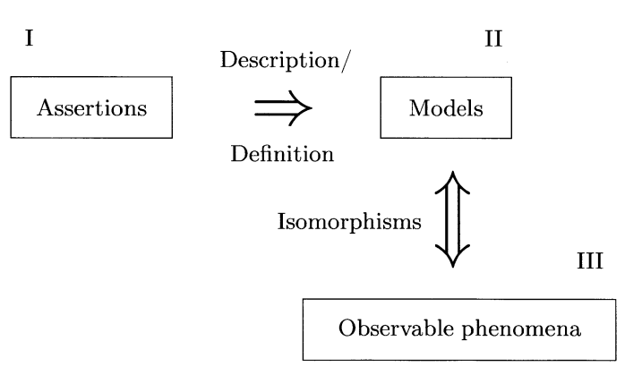

date: {{ page.date | date: "%Y.%m.%d" }}

# Theory, Model and Reality

(to be uploaded)

Regarding the statement <theories are deterministic>, I should primarily think about this in two layers: the framework-level and the system-level.
For example, the statement <Newtonian mechanics is deterministic> is frequently used among many scientists but actually this alone is somewhat imprecise. At the framework-level, Newtonian mechanics with second-order differential equations might be deterministic, but at the system-level, it is only deterministic when defined a system where:

1. the functions constituting the equations are (locally) [Lipschitz continuous](https://en.wikipedia.org/wiki/Lipschitz_continuity)
2. it's a well-posed problem (by the [Picard-Lindelof theorem](https://en.wikipedia.org/wiki/Picard%E2%80%93Lindel%C3%B6f_theorem))

For systems without these conditions Newtonian mechanics is not deterministic (e.g., Norton's dome).

Classical field theory is similar. For instance, in (classical) EM, just having Maxwell's eqns doesn't make it deterministic like Abraham-Lorentz force producing runaway solutions  so these are not well-posed. Without additional conditions, cannot call EM is deterministic. 

In general relativity, while Einstein's field eqns might be called deterministic so \<GR '[on globally hyperbolic spacetime](https://en.wikipedia.org/wiki/Globally_hyperbolic_manifold)' is deterministic\> rather than \<'GR' is deterministic\>. Same as in complex systems and chaos theory, in these cases, when frameworks and systems that satisfy conditions for existence and uniqueness of solutions are deterministic, systems can be practically unpredictable or often have fundamentally non-derivable phenomenon at the framework level (ex. coarse-graining), making them appear as if non-deterministic (though they actually are not).
In quantum theory, interpretations diverge selectively from the framework-level itself. Quantum postulates normally described as standard in (non-relativistic) QM typically include:

1. kinematical Hilbert space as the state space
2. observables and operators
3. 'time evolution' of state vectors as unitary evolution and introducing the Schrodinger eqn
4. measurement and eigenvalues (+ Born rule, collapse, etc.)
5. Probabilistic interpretation of measurement

1,2,3 are deterministic. Schrodinger eqn is also completely deterministic. In a similar sense, QFT formalism corresponding to such deterministic flow in the eqns acting on field operators in the Heisenberg picture and relativistic dynamics are deterministic at the framework-level.

But the results actually observed at the system-level are not deterministic so not much different from QM. At this level from the perspective of EFT like IR/UV cutoffs, this depends on the range (since perturbation induced SSB can be seen as degeneracy where the vacuum field is chosen) but anyway I cannot say it's deterministic or not at 'all scales'.
4 and 5 are actually matters of choice. Copenhagen interpretation includes these in its postulates, making it nondeterministic at the framework-level. In contrast, Dirac formalism or Bohmian or ensemble interpretations are 'deterministic'.

In principle most physics theories have never been 'completely' deterministic in this sense. There were people who wanted to believe they were though (ex. Newton, Laplace, Einstein...)

  <a href="{{ '/Phys/WP/what_content.html' | relative_url }}" class="prev-button">Previous</a>

